**布局**

**样式**

**信号与槽**

**内存管理方式**

# 基础

## 参数

### 按钮

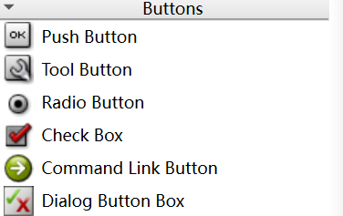

### 占位

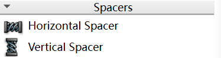

### “盒子”

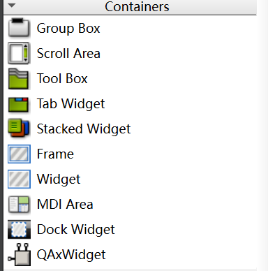

## 按钮

#### QCheckBox

对应

两个参数：第一个为按钮名字，第二个为其指针。通常情况下，传第一个参数时，使用tr()包裹一下，目的是翻译；第二个参数可空指针或省略。

#### QRadioButton

对应

#### QPushButton

对应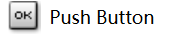

## 布局

#### QHBoxLayout--水平布局

###### addWidget(ptr)

作用为：QHBoxLayout类将控制ptr对应的元素的UI

###### addStretch(int)

“空白占位小弹簧”

#### QVBoxLayout--垂直布局

###### addLayout

对应addWidget(ptr)

#### 常用函数

##### setSpacing()

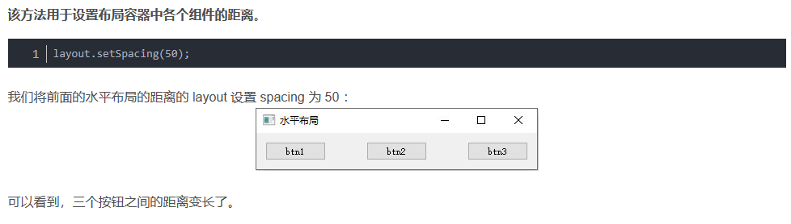

##### addSpacing()

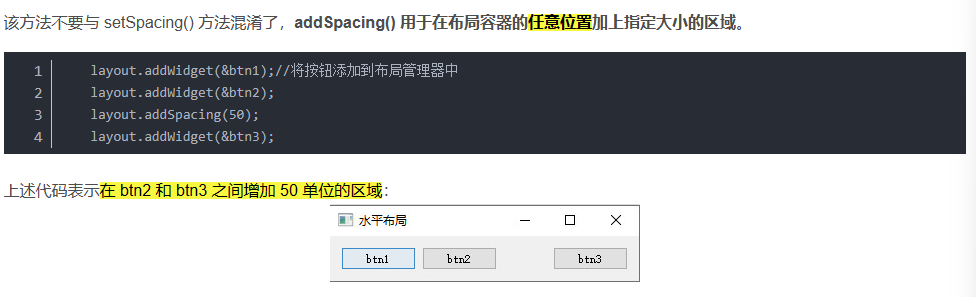

##### setStretch ( int index, int stretch ) 设置拉伸比例

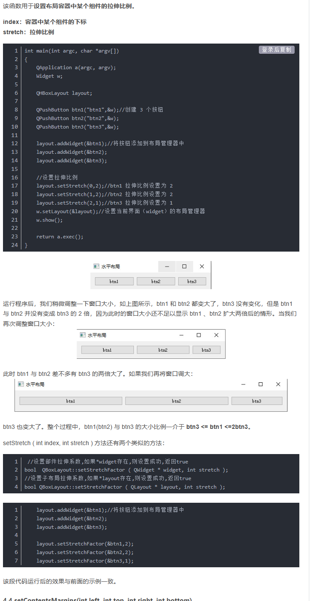

##### setContentsMargins(int left, int top, int right, int bottom)

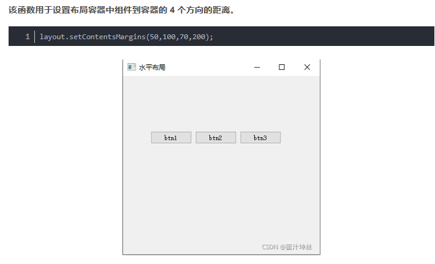

#####  QFormLayout 表单布局

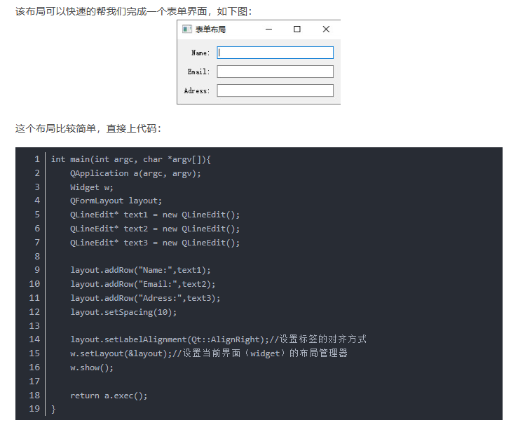

##### QGridLayout 网格布局

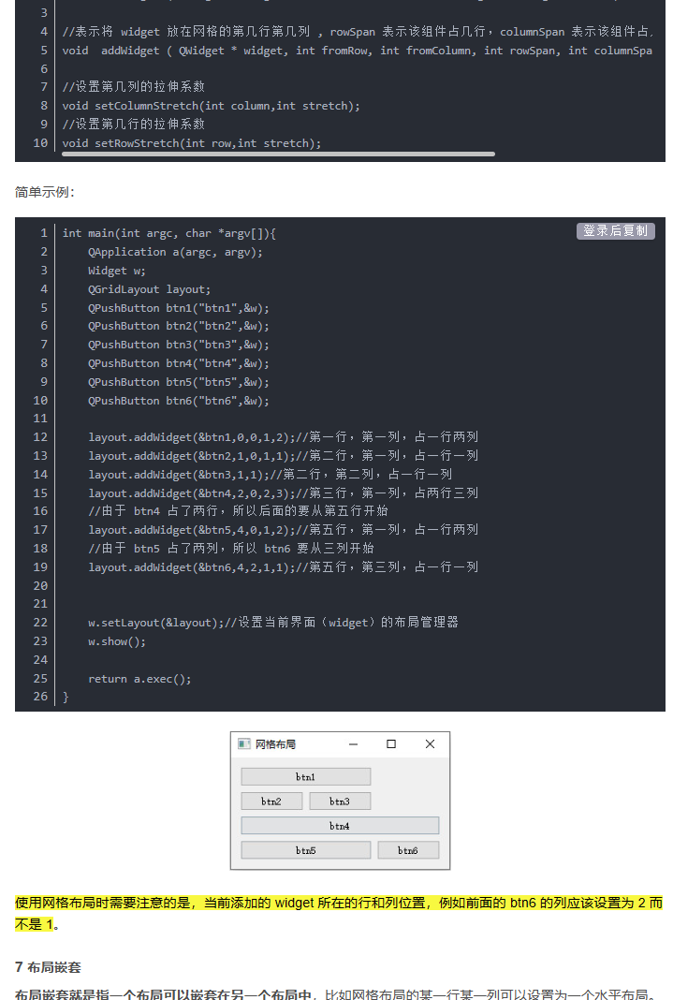

#####  布局嵌套

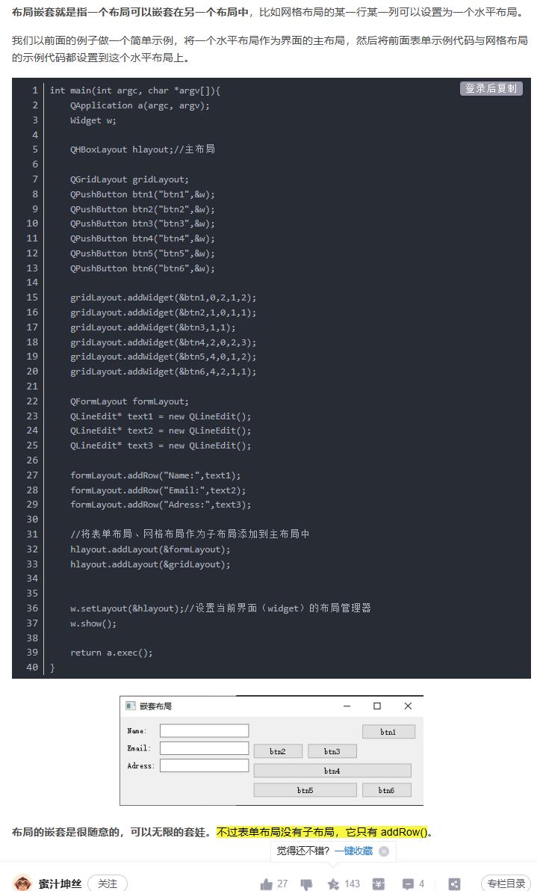

##### setLayout

setLayout()的参数为上两个类指针

## 四种模式

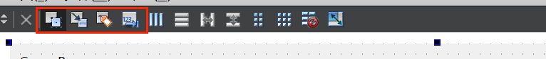

## 信号与信号槽

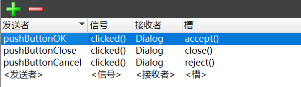

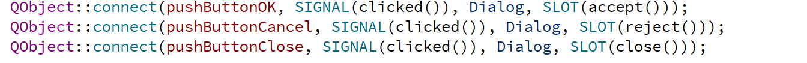

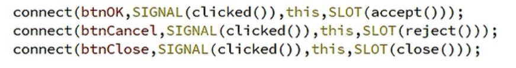

**三者的关系**

# 认识QT

## UI文件设计与运行机制

.pro 项目管理文件

.ui 界面文件

主函数

图形相关文件

.h文件

.cpp

ui\_\*\*_.h

## 可视化UI

### 界面UI

### 三种信号触发方式

###### 第一种

1. 在UI界面选中目标，并右键点击，选择对应函数

2. 编写对应逻辑

   

###### 第二种

> 将ui_dialog.h的内容提到cpp文件里

编译生成的ui_dialog.h文件中，有对应的调用函数及逻辑，可将其拷贝修改至CPP文件

可以认为是第一种的手动版，但CPP的文件不会随着ui的改动而变化。

## 代码化UI

没有UI文件，需要自己设计界面，较抽象。

# 实例

### 场景1

#### 菜单栏

##### 历史

> 一开始，将菜单栏定义成了一个widget，然后将其他组件填充到该widget中，虽然能做到说平有序排放，但是标题无法保证一直处于中心。
>
> 解决方案：将菜单栏分成三部分，定义四个widget，其中菜单栏一个，其他三部分一个。左右两部分固定大小，中间的为标题部分，对齐进行水平布局
