# QT Creator

> 1. **常规操作：**
>    - 打开新文件：Ctrl + N
>    - 打开项目：Ctrl + O
>    - 保存：Ctrl + S
>    - 撤销：Ctrl + Z
>    - 重做：Ctrl + Y
>    - 剪切：Ctrl + X
>    - 复制：Ctrl + C
>    - 粘贴：Ctrl + V
>    - 查找：Ctrl + F
>    - 替换：Ctrl + R
> 2. **编译和运行：**
>    - 编译：Ctrl + B
>    - 构建所有：Ctrl + Shift + B
>    - 运行：Ctrl + R
>    - 调试：F5
>    - 停止：Ctrl + Shift + F5
> 3. **代码导航：**
>    - 转到定义：F2
>    - 转到声明：F3
>    - 转到实现：F4
>    - 在当前文件中查找使用：Ctrl + Shift + F7
>    - 在项目中查找使用：Ctrl + F7
>    - 转到上一个/下一个光标位置：Alt + 左/右箭头
> 4. **窗口切换：**
>    - 切换编辑器和项目栏：Alt + 左箭头
>    - 切换编辑器和输出栏：Alt + 右箭头
>    - 切换编辑器和调试栏：Alt + 上箭头
> 5. **版本控制：**
>    - 打开版本控制操作：Alt + 0
>    - 查看版本控制输出：Alt + 2

# 基础

## 控件

> 1. label：标签，可以显示文本信息，只读；
> 2. pushbutton ： 普通按钮；
> 3. radiobutton ： 单选按钮，多个单选按钮中只能选择一个，但是必须放入groupbox中，类似单选题；
> 4. checkbox ： 多选复选按钮，可以选择同时选择多个，类似多选题；
> 5. lineedit ： 单行文本编辑框，可以输入单行文本；
> 6. textedit ： 多行文本输入框，可以输入显示多行文本和图片；
> 7. combobox ： 下拉文本输入框，在输入框的最右边有个三角下拉按钮，可以选择输入，也可以手动输入；
> 8. textbrower ： 多行文本显示框，只读；
> 9. groupbox ： 可以在里面放入特点的东西，统一管理；
> 10. slider ： 模拟显示滑动条；
> 11. spinbox ： 数值显示滑动条；
> 12. dateedit ：
> 13. timeedit ：
> 14. datetimeedit ：
> 15. lcdnumber ：

## 基础类

### QAbstractButton

> QAbstractButton 类是按钮小部件的抽象基类，提供按钮通用的功能。

1. 设置文本

2. 设置主题(图像)及大小

3. 设置快捷键

4. 设置默认选择按钮

5. 四种选择

6. 四种信号

7. - 是否独占
    - 是否重复，及重复间隔
    - 是否可以被选中
    - 是否被选中
    - 是否按下
    - 助记符，文本

### QWidget Class

> QWidget 类是所有用户界面对象的基类。

1. 函数
2. 设置子部件的描述和名称
3. 是否填充小部件背景
4. 设置小部件的基本尺寸，位置，max/min
5. 设置字体
6. 是否最大化，最小化，滑动窗口
7. ...

### QLabel

> QLabel 用于显示文本或图像。不提供用户交互功能。标签的视觉外观可以通过多种方式进行配置，并且可以用于为另一个小部件指定焦点助记键。
>
> 

1. 是否有内容被选中
2. 保存选定的文本
3. 设置文本缩进
4. 边距
5. 是否自动打开文本里的链接
6. 设置图片
7. 是否缩放图片，使得像素图填充可用空间
8. 设置文本
9. 设置文本格式
10. 是否自动换行

## 样式表

> 选择器+声明，可以指定一个类型，对象，控件的样式风格。
>
> 1. Qt 官方文档：Qt 官方文档提供了有关 Qt 样式表的详细说明和示例。您可以查阅官方文档以获取更多信息。
>    - Qt 样式表文档（英文）：https://doc.qt.io/qt-5/stylesheet.html
> 2. Qt Style Sheets Examples：Qt 官方提供了一些 Qt 样式表的示例，展示了不同控件的样式设置和效果。您可以通过这些示例来学习和尝试 Qt 样式表的用法。
>    - Qt 样式表示例（英文）：https://doc.qt.io/qt-5/stylesheet-examples.html
> 3. Qt Style Sheets Reference：这个页面列出了 Qt 样式表中可用的所有属性和伪状态，以及它们的描述和使用方式。您可以在这里找到您需要的属性和伪状态的信息。
>    - Qt 样式表参考（英文）：https://doc.qt.io/qt-5/stylesheet-reference.html
> 4. Qt Style Sheets Examples on GitHub：Qt 在 GitHub 上提供了一些 Qt 样式表的示例代码，您可以查看源代码并尝试运行这些示例。
>    - Qt 样式表示例代码（英文）：https://github.com/qt/qtstyleplugins/tree/dev/examples/stylesheet

### 选择器类型

> 
>

1. 按类选，且包含它的子类
2. 按类选，且不包含它的子类
3. 按对象ID选
4. 按属性要求选


### 子控件

### 伪状态

> 
>
> **一些伪装态可以设置在样式表，一些则只能通过函数设置。和样式表一样，通过函数设置时，也可以选择对象调用函数设置，或者是类内调用函数设置**

1. 鼠标悬停/未悬停


## 布局

### 水平布局/垂直布局

### 弹簧

### DPI变化


## 信号和槽

> 

[Qt一篇全面的信号和槽函数机制总结 - 知乎 (zhihu.com)](https://zhuanlan.zhihu.com/p/603617075)

[Qt 信号和槽的机制（逻辑清晰的来说清楚信号和槽，呕心沥血之作）_qt的信号与槽机制原理-CSDN博客](https://blog.csdn.net/ifeng12358/article/details/120880153)

# 认识QT

## UI文件设计与运行机制

.pro 项目管理文件


.ui 界面文件


主函数

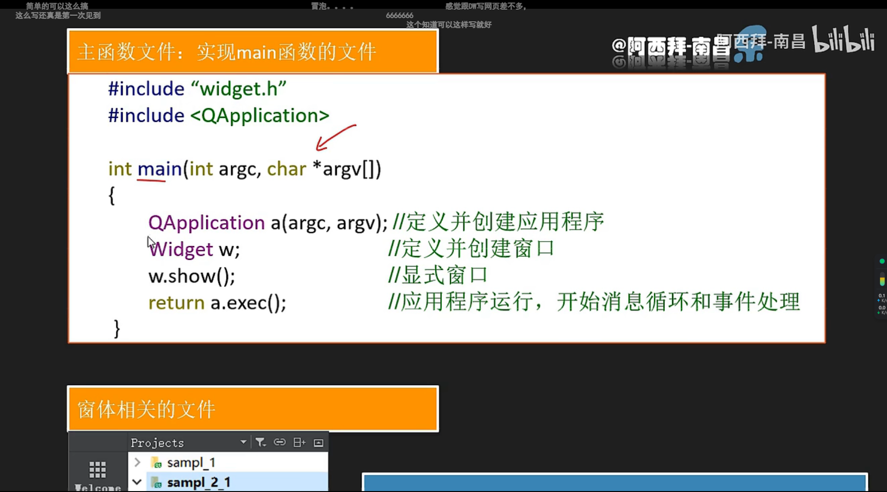

图形相关文件


.h文件


.cpp


ui\_\*\*_.h


## 可视化UI

### 界面UI


### 三种信号触发方式

###### 第一种


1. 在UI界面选中目标，并右键点击，选择对应函数


2. 编写对应逻辑


   

###### 第二种

> 将ui_dialog.h的内容提到cpp文件里


编译生成的ui_dialog.h文件中，有对应的调用函数及逻辑，可将其拷贝修改至CPP文件


可以认为是第一种的手动版，但CPP的文件不会随着ui的改动而变化。

## 代码化UI


没有UI文件，需要自己设计界面，较抽象。

## 混合UI


# 实例

### 场景1：UI


#### 实现

#### 构思

> 

#### 效果

> 默认
>
> 

> 拉伸
>
> 
>
> 

> 账号按钮
>
> 

> 隐藏按钮
>
> 

> 伪类选择器
>
> 

### 场景2：消息框

> 实现一个消息列表，能够将业务处理过程中产生的信息打印在窗口上
>
> 

#### 组件

##### TextEdit

> 能够进行输入输出
>
> 

#### 实现逻辑

##### 获取主窗口指针

> 通过包含主窗口指针的方式，进而获取textEdit组件的指针，对其进行操作。
>
> 首先该逻辑能够实现消息框功能，但是让一个类随意获取到主窗口指针是很危险的行为，并且通过这个函数调用的方式实现输出消息的传输，也会让业务逻辑的处理和输出消息的打印变成了顺序关系。
>
> 既不高内聚，又不低耦合

~~~C++
class tmpClass{
    
    tmpClass(MainWindow * uii);
    
    MainWindow * ui;
    
    void PrintText()
    {
        ui->textEdit->append("message");
    }
}
~~~

##### 信号和槽

> 在tmpClass类中添加一个信号函数，该函数接受输出消息，当我们需要打印输出消息时，将消息传给该信号函数，并触发该函数。
>
> 在主窗口类添加一个槽函数，该函数可以接受输出消息，并将该消息打印到textEdit上。
>
> 使用信号和槽的方式，使得tmpClass在触发信号后，不再关心该消息什么时候打印，进而可以继续执行接下来的业务逻辑，将业务逻辑和打印消息进行了解耦。

~~~C++
class tmpClass{
public:
    
signals:
    void updateTxt(const QString& txt);
}

class MainWindow{
private slots:
    void onUpdateTxt(const QString& txt)
    {
        ui->textEdit->append(txt);
    }
}
~~~

### 场景3：多线程

~~~C++
MainWindow {

    
    SharedPointer<BackupMacker>  bm;

    MainWindow() {

    }
    backupBtnClicked() {
        bm = SharedPointer<BackupMacker>(new BackupMacker)
        bm->start()
    }
    backupStopClicked() {
        bm->stop()
        stopIndicatorAnimationShow();
    }

    slotOnStart() {
        showBackupPendingUI ...
    }

    slotOnStop() {
        stopIndicatorAnimationHide();
    }

    slotOnProgress(progress) {
        ui.progressbar.setValue(progress)
    }

}


BackupMaker {

    thread th;
    exitFlag = false;

    signal onStart()
    signal onProgress()
    signal onStop()
    signal onLog()
    signal onErr()

    BackupMaker() {
        ...
    }

    start() {
        // 启动线程
        // 1. 允许启动两次吗？ 当备份服务已经在进行时，再次调用该函数，应该怎么办？
        // 禁止调用；进行提示：备份服务进行中
        th = startThread(threadFunc)
    }

    stop() {
        // 终止线程，主线程调用
        exitFlag = true // 停止标志，让线程“正常退出” 
        th.join();    // 阻塞等待
    }

    threadFunc() {
        emit onStart
        exitFlag = false
        connectDevice ..
        connectLockdown ..
        startBackupService ...

        while(true) {
            if (exitFlag) {
                break;
            }
            if (errFlag) {
                break;
            }
            readMessage ..
            dispatchMessage ..
            emit onProgress()
        }

        do clean thins....
        emit onStop()

    }
}
~~~

### 场景4：进度条

> 设置范围最大值/最小值
>
> 设置当前值、重置为默认值
>
> 进度条文本相关设置：样式，对齐，是否显示等

> 通常是业务逻辑处理后获取进度，触发信号告知对应槽函数当前进度，槽函数再去设置进度条进度

### 实例5：界面调整

> 


# deBug

#### 在构造函数里设置样式不生效


解决办法


#### 自写类样式不生效


#### 字体类型

> 字体类型跟系统走，若系统没有样式所指定的字体类型，则就会无法匹配到合适的字体。
>
> 且字体类型的匹配按顺序匹配，从左至右，知道某个字符匹配到字符

#### DPI

> 开发中，DPI默认为100%模式，但有时候窗口可能会变成高DPI模式，这时候，窗口的尺寸就会失真，达不到我们想要的效果。
>
> 为了解决这个问题，QT支持窗口随DPI变化而改变的需求，使用如下：
>
> 
>
> 第一行用来开启高DPI支持
>
> 第二行用来开启非整数倍缩放因子
>
> 第三行用来设置缩放因子的四舍五入规则

#### 图像

> 图像不能无限扩大，否则会出现锯齿，失真等问题，所以在开发中，一般最高支持2倍扩大，为了保证图像的正常显示，属性一般这样设置：
>
> 
>
> 
>
> 最大最小保证图片不能无限被所需扩大，而填充属性，则用来保证图片的正常比例。

#### 移植问题

> 尽量使用更“高级”的语言，依赖于语言自己实现的多版本控制。

#### 字符编码与QT

~~~C++
Utils.h

extern "C"
void removeDir(const char * path);

Utils.cpp

#include <QDir>

int removeDir(const char * path) {
    QString str = QString::fromUTF8(path)
    QDir dir(str)
    return dir.removeRecursively()
}


main.c 


#include "Utils.h"


....

const char * path ...
int ret = removeDir(path) ..

ANSI 字符集  2字节 2字节 2字节  GBK  GB2312

Unicode [汉语段][日语段]  GBK18030

Utf-8 3`4 字节 linux,mac,ios,android,web
Utf16  双字节定长  UCS2 windows默认UTF编码
Utf32
    emojii

WIDECHAE 字符集

字符串 ANSI UCS2

ReadFileA
ReadFileW

ansi UCS2/utf16
_T("c:\\abcd")
\

#ifdef UNICODE
    #define ReadFile  ReadFileW
#else
    #define ReadFile  ReadFileA
#endif


编译器定义 UNICODE IDE环境的默认参

const char *
const wchar_t *

QT QDir QFile
c/c++
OS.api

remove()
return success failed

c/c++ Unix

errno

if (-1 == RemoveFile(...)) {
    err = GetLastError;
    errcode = 0;
    switch(err) {
        case ERROR_FILE_NOT_FOUND:
            errcode = -6;
            errdesc = "cccc"
            ..
    }
    
}

c std lib errno -> device error

windows api last error code  -> device error

QT


// return c-styled errcode
int RemoveDir(,,.) {

    if (!pathExists(...)) {
        return ENOENT
    }

    return 0;

}
~~~

#### 槽函数为lambda表达式时

> 因为信号与槽是异步的，触发信号并不代表槽函数立马执行，在适当的时候进行调用。如果槽函数为lambda表达式，那么就可能需要捕获上下文数据，如果被捕获到的数据在槽函数执行时，其声明周期已经结束了，就有可能造成内存泄漏的问题，因为变量所在的内存已经归还了，对该变量进行操作就是违法的。
>
> 如：
>
> ~~~C++
> {
> TestClass *a = new();
> 
> connect(..., ..., [&](){
>     ...;
>     a->func();
>     ...;
>     delete a;
> });
> }
> ~~~
>
> 那么，在执行到lambda表达式时，函数已经结束把栈释放了，虽然a指向的空间存在，但a是不存在。引用传参，会找到对应的内存，当找到a原先的位置时，因为该内存已经归还了，再对其进行操作就是非法的野指针访问。
>
> 


# [libimobiledevice](https://github.com/libimobiledevice/libimobiledevice)

> 
>
> 

## 服务简介

#### lcokdownd


#### AFC


#### NP


#### mobilebackup移动备份服务


#### com.apple.itunes.lock_sync


## API

### idevice_new_with_options：将对象绑定到udid指定的设备

>
>该函数可以根据udid将对应的设备绑定到device对象上，并通过第三个参数，指定了该设备的连接方式。
>~~~C++
>int idevice_new_with_options(idevice_t* device, const char* udid, uint16_t options);
>idevice_new_with_options(&device, udid, IDEVICE_LOOKUP_USBMUX | IDEVICE_LOOKUP_NETWORK);
>
>//释放
>idevice_free(device);
>~~~
>
>

> 
>
> 

### lockdownd_client_new：将lockdownd 客户端对象绑定到指定的设备对象

> 该函数可以通过device对象创建一个lockdownd服务客户端对象，但需要自己处理之后的通信协议细节
>
> ~~~C++
> int lockdownd_client_new(idevice_t device, lockdownd_client_t* client, const char* label);
> lockdownd_client_new(device, &client, TOOL_NAME);
> 
> //释放
> lockdownd_client_free(client)
> ~~~
>
> 

> 
>
> 

**lockdownd对象**

> 

**返回值对应的宏**

> 

### lockdownd_get_device_name：获取设备名字

> 该函数可以通过lockdo客户端对象获取其绑定的设备的名字。
> ~~~C++
> int lockdownd_get_device_name(lockdownd_client_t client, char** device_name);
> lockdownd_get_device_name(client, &device_name)
> ~~~
>
> 

> 

### lockdownd_pair：进行配对操作

> 该函数可以将lockdownd客户端对象与其绑定的设备进行配对，以建立一个互相信任的通信。
>
> ~~~C++
> lockdownd_pair(client, NULL);
> idevice_error_t lockdownd_pair(lockdownd_client_t client, plist_t *pair_record);
> ~~~
>
> 

> 

### userpref_get_paired_udids：获取已配对设备列表

> 能够获取已配对设备的UDID列表
>
> ~~~C++
> userpref_get_paired_udids(&udids, &count);
> idevice_error_t userpref_get_paired_udids(const char *udid_list[], int *count);
> ~~~
>
> 

> 

### idevice_get_udid：获取链接的设备的UDID，默认只连接了一部

> 通过idevice对象，获取其所连接的设备的UDID
>
> ~~~C++
> idevice_get_udid(device, &udid);
> idevice_error_t idevice_get_udid(idevice_t device, char **udid);
> ~~~
>
> 

> 

### userpref_read_pair_record：获取udid对应设备的历史配对记录

> 能够通过udid，获取到其对应的设备历史配对记录，并将其保存在一个列表里。
>
> ~~~C++
> userpref_read_pair_record(udid, &pair_record);
> userpref_error_t userpref_read_pair_record(const char *udid, plist_t *pair_record)
> ~~~
>
> 

> 

### pair_record_get_host_id：提取记录中主机ID

> 通过记录列表中的信息，提取到主机ID，并将其保存在一个字符串数组里。
>
> ~~~C++
> pair_record_get_host_id(pair_record, &hostid);
> userpref_error_t pair_record_get_host_id(plist_t pair_record, char** host_id)
> ~~~
>
> 

> 

### lockdownd_query_type：查询设备类型

> 用于查询设备的特定信息或属性
>
> ~~~C++
> lockdownd_query_type(client, &type);
> LIBIMOBILEDEVICE_API lockdownd_error_t lockdownd_query_type(lockdownd_client_t client, char **type)
> ~~~

> 

### lockdownd_client_new_with_handshake：用于与 iOS 设备上的 "lockdownd" 守护进程建立连接并进行握手

> 相较于lockdownd_client_new，做了更多的事：建立lockdownd服务客户端对象后，会自己处理通信协议
>
> ~~~C++
> lockdownd_client_new_with_handshake(device, &client, TOOL_NAME);
> LIBIMOBILEDEVICE_API lockdownd_error_t lockdownd_client_new_with_handshake(idevice_t device, lockdownd_client_t *client, const char *label)；
> ~~~
>
> 

> 
>
> 

### lockdownd_unpair：解除lockdownd_client对象与设备的配对

> 用于解除设备与主机的配对关系。
>
> ~~~C++
> lockdownd_unpair(client, NULL);
> lockdownd_error_t lockdownd_pair(lockdownd_client_t client, lockdownd_pair_record_t pair_record)
> ~~~
>
> 

### lockdownd_start_service：

> 用于启动指定的服务。
>
> ~~~C++
> lockdownd_start_service(lockdown, AFC_SERVICE_NAME, &service);
> lockdownd_error_t lockdownd_start_service(lockdownd_client_t client, const char *identifier, lockdownd_service_descriptor_t *service)
> ~~~
>
> 

> 
>
> 

### afc_client_new：用于创建一个 AFC（Apple File Conduit）客户端对象。

> 通过device，service创建一个afc对象。
>
> ~~~C++
> afc_client_new(device, service, &afc);
> afc_error_t afc_client_new(idevice_t device, lockdownd_service_descriptor_t service, afc_client_t * client)
> ~~~
>
> 

> 

### lockdownd_start_service_with_escrow_bag：用于启动带有保管袋（escrow bag）的服务。

> 用于启动带有保管袋（escrow bag）的服务。保管袋是一种加密的文件，用于存储设备密钥和其他安全相关的信息。通过lockdownd客户端对象和指定的服务，并将其保存在第三个参数里。
>
> ~~~C++
> lockdownd_start_service_with_escrow_bag(lockdown, MOBILEBACKUP2_SERVICE_NAME, &service);
> lockdownd_error_t lockdownd_start_service_with_escrow_bag(lockdownd_client_t client, const char *identifier, lockdownd_service_descriptor_t *service)
> ~~~
>
> 

> 

### mobilebackup2_client_new：用于创建一个 MobileBackup2 客户端对象

> 通过deiveice对象，服务，创建一个客户端对象，并将其保存在第三个参数里。
>
> ~~~C++
> mobilebackup2_client_new(device, service, &mobilebackup2);
> mobilebackup2_error_t mobilebackup2_client_new(idevice_t device, lockdownd_service_descriptor_t service,
> 						mobilebackup2_client_t * client)
> ~~~
>
> 

> 

### mobilebackup2_version_exchange：交换版本号

> 通过mobilebackup2客户都对象，与服务的交换版本号
>
> ~~~C++
> mobilebackup2_version_exchange(mobilebackup2, local_versions, 2, &remote_version);
> mobilebackup2_error_t mobilebackup2_version_exchange(mobilebackup2_client_t client, double local_versions[], char count, double *remote_version)
> ~~~
>
> 

> 

### do_post_notification：用于在给定的设备上发送通知。

> 给给定的设备发送通知
>
> ~~~C++
> do_post_notification(device, NP_SYNC_WILL_START);
> static void do_post_notification(idevice_t device, const char *notification)
> ~~~
>
> 

> 

### afc_file_open：用于在 AFC（Apple File Conduit）连接上打开文件的函数。它的作用是在给定的 AFC 连接上打开指定路径的文件，并将文件句柄存储在 `lockfile` 变量中。

> 
>
> ~~~C++
> afc_file_open(afc, "/com.apple.itunes.lock_sync", AFC_FOPEN_RW, &lockfile);
> afc_error_t afc_file_open(afc_client_t client, const char *filename, afc_file_mode_t file_mode, uint64_t *handle)
> ~~~
>
> 

> 

## 功能

### 查询设备名字

##### 获取idevice对象

~~~C++
idevice_new_with_options(&device, udid, IDEVICE_LOOKUP_USBMUX | IDEVICE_LOOKUP_NETWORK);
~~~

- 如果指定了udid，则会获取到udid对应的设备；

- 如果没有指定，则udid对应实参传NULL，随机获取一个连接的设备

通过device对象，可以获取到设备的udid

##### 获取lockdownd服务客户端对象

~~~C++
lockdownd_client_new(device, &client, TOOL_NAME)
~~~

- 通过device对象，可以建立获得一个lockdownd客户端对象，用来锁定设备
- 第三个参数用来指定lockdownd服务名称

##### 获取设备名称

~~~C++
lockdownd_get_device_name(client, &device_name)
~~~

- 通过client对象，能够获得设备的名称

### 设置设备名字

##### 获取设备对象

##### 获取完整的lockdownd服务客户端对象

此处的完整是指，不仅需要获得lockdownd服务客户端对象，这个对象还需要完成后续的协议和身份验证之类的过程。相较于with_options，with_handshake更加完整，但耦合性也高。

~~~C++
lockdownd_client_new_with_handshake(device, &lockdown, TOOL_NAME);
~~~

##### 向手机发送请求

~~~C++
lockdownd_set_value(lockdown, NULL, "DeviceName", plist_new_string(argv[0]));

LIBIMOBILEDEVICE_API lockdownd_error_t lockdownd_set_value(lockdownd_client_t client, const char *domain, const char *key, plist_t value)
{
	if (!client || !value) // 判断服务和名字是否存在
		return LOCKDOWN_E_INVALID_ARG;

	plist_t dict = NULL;
	lockdownd_error_t ret = LOCKDOWN_E_UNKNOWN_ERROR;

    // 构建请求
	/* setup request plist */
	dict = plist_new_dict();
	plist_dict_add_label(dict, client->label);
	if (domain) {
		plist_dict_set_item(dict,"Domain", plist_new_string(domain));
	}
	if (key) {
		plist_dict_set_item(dict,"Key", plist_new_string(key));
	}
	plist_dict_set_item(dict,"Request", plist_new_string("SetValue"));
	plist_dict_set_item(dict,"Value", value);
	
    // 发送请求
	/* send to device */
	ret = lockdownd_send(client, dict);

	plist_free(dict);
	dict = NULL;

	if (ret != LOCKDOWN_E_SUCCESS)
		return ret;
	
    // 接受回复
	/* Now get device's answer */
	ret = lockdownd_receive(client, &dict);
	if (ret != LOCKDOWN_E_SUCCESS)
		return ret;

	ret = lockdown_check_result(dict, "SetValue");
	if (ret == LOCKDOWN_E_SUCCESS) {
		debug_info("success");
	}

	if (ret != LOCKDOWN_E_SUCCESS) {
		plist_free(dict);
		return ret;
	}

	plist_free(dict);
	return ret;
}
~~~

- 构建SetValue请求字典
- 发送请求字典到设备
- 设备处理请求,返回响应字典
- 接收响应字典
- 从响应字典校验设置操作是否成功

### 查询设备ID

##### 获取当前主机所连接的设备的记录列表

~~~C++
idevice_get_device_list_extended(&dev_list, &i)
~~~

- 可以直接获取当前设备保存的连接设备的链表
- 当返回值为负数时，代表获取失败
- 当没有设备连接时，也是可以返回成功的
- 其中，i值代表连接设备的个数
- dev_list存储了连接设备的大量信息

##### 读取配置文件？

~~~C++
userpref_get_paired_udids(char ***list, unsigned int *count)
~~~

### 配对/解除配对

##### 创建device对象

~~~C++
idevice_new_with_options(&device, udid, (use_network) ? IDEVICE_LOOKUP_NETWORK : IDEVICE_LOOKUP_USBMUX);
idevice_get_udid(device, &udid);
~~~

- 创建对象
- -获取udid

##### 创建lockdownd客户端对象

~~~C++
lockdownd_client_new(device, &client, TOOL_NAME);
~~~

- 仅创建lockdownd客户端对象

##### 处理握手过程

包括：

- 查询类型（query_type）
- 验证配对（validate_pair）
- 配对（pair）
- 启动会话（start_session）
- 等

##### 查询类型

~~~C++
lockdownd_query_type(client, &type);
~~~

##### 配对

~~~C++
lockdownd_pair(client, NULL);
~~~

##### 解除配对

~~~C++
lockdownd_unpair(client, NULL);
~~~

### 验证配对

##### 创建device对象

##### 创建自动处理握手的lockdownd对象

~~~C++
lockdownd_client_new_with_handshake(device, &client, TOOL_NAME);
~~~

- 如果调用成功，则代表能够配对
- 否则，代表验证失败

##### 解除配对

### 备份

##### 准备工作

> 确认cmd为备份操作，确认备份路径存在

##### 创建idevice对象

##### 创建自动握手的lockdownd客户端对象

##### 生成info.plist路径

> 可以确认当前备份逻辑是全量还是增量

##### 开启NP服务：通知服务

- 开启服务
- 创建np客户端对象
- 设置np通知回调函数

##### 开启AFC服务：文件传输服务

- 开启服务
- 创建对象

##### 开启备份服务——1

- 开启带有”保管带“的备份服务

- 创建备份服务客户端对象

- 交换版本

- 判断备份方式：全量/增量：非必要

  

##### 处理afc文件——2

- 打开指定文件：/com.apple.itunes.lock_sync，打开并锁定
- 同步通知
- 处理文件句柄
- 请求同步锁
- 进行文件独占
- 同步开始通知

##### 生成目录并请求备份服务——3

- 创建属于手机udid的备份目录
- 处理一些杂项
- 发送备份请求

##### 开始文件传输

> 手机端打包好之后，将数据发送给PC端

- 下载文件
- 上传文件
- 获取可用空间
- 清理空间
- 获取目录内容
- 创建目录
- 移动文件
- 删除文件
- 复制项目
- 断开连接
- 处理消息

## BUG

### 已解决

#### 文件/目录删除问题

> 移植过程中，调用的函数可能是OS的API、编译器的库、语言的库。它们各自有环境问题的考虑。
>
> 如果调用了OS的API，则必须进行替换；如果是后两个，也可能出现问题，更加支持语言的库。

> 在备份过程中，会执行删除文件/目录的操作，此时就需要考虑执行这个功能的函数是否考虑了不同环境下，还有就是文件的路径是什么形式的，Linux？Windows？
>
> 库里有一个路径拼接函数：string_build_path，经测试，实现的Linux类型的分隔符，即 “D:/Test/aa.txt”。
>
> 库里的删除目录/文件的函数为：
>
> ~~~C++
> static int remove_file(const char* path)
> {
>     int e = 0;
> #ifdef WIN32
>     if (!DeleteFile(path)) {
>         e = win32err_to_errno(GetLastError());
>     }
> #else
>     if (remove(path) < 0) {
>         e = errno;
>     }
> #endif
>     return e;
> }
> 
> static int remove_directory(const char* path)
> {
>     int e = 0;
> #ifdef WIN32
>     if (!RemoveDirectory(path)) {
>         e = win32err_to_errno(GetLastError());
>     }
> #else
>     if (remove(path) < 0) {
>         e = errno;
>     }
> #endif
>     return e;
> }
> ~~~
>
> 环境为WIN32，会执行Windows的API删除函数，但API删除函数需要的参数不是简单的字符串指针，而是宽字符串的指针，所以平常的路径作为参数时，API函数调用会失败。
>
> 以下为API正常调用情况：
>
> ~~~C+++
> #include <fileapi.h>
> #include <stdio.h>
> int main()
> {
>     LPCWSTR filePath = L"D:\\TestBackUp\\abc/aa.txt";
>     int ret = DeleteFile(filePath);
>     printf("%d\n", ret); // 非0为正常返回
> 
>     return 0;
> }
> ~~~

> 要不然在remove_file函数里，对路径转换一下；要不然直接使用QT的文件类(标准库的remove函数)，具有更高的兼容性。

#### utils.h

> 其所声明的所有函数，在C文件中可以，CPP文件中不可用。
>
> 如`string_build_path(...)`
>
> ~~~C++
> #include <libimobiledevice-glue/utils.h>
> ~~~

> 原因：utils对应的文件是C函数，需要extern“C”，预处理。

#### 标准库转QT库

> 在项目开发过程中，当一些库具有相同功能的函数时，希望使用更改层次的函数。
>
> 如remove转向QFile::remove，需要注意返回值和内部逻辑判断。
>
> 返回值：remove成功为0，失败为-1，QFile::remove成功为true，返回为false

> 比如标准库的remove在删除某个文件时，若路径不存在，将返回ENOENT；而QFile直接remove会返回false。
>
> 这时候就需要自己去写逻辑判断路径是否存在，并返回对应的值。

#### 如何加载外部库

> ~~~C++
> CONFIG(debug, debug|release) {
>     DEBUG_OR_RELEASE = debug
> }  else {
>     DEBUG_OR_RELEASE = release
> }
> 
> # 加载库
> # thirdparty libraries
> include($$PWD/../thirdparty/thirdparty.pri)
> 
> SOURCES += \
>     main.c \
>     mainbackup.cpp
> 
> # Default rules for deployment.
> qnx: target.path = /tmp/$${TARGET}/bin
> else: unix:!android: target.path = /opt/$${TARGET}/bin
> !isEmpty(target.path): INSTALLS += target
> ~~~

# QNetWork

## 初识

**组件+头文件**

> 

头文件

> ~~~C++
> #include <QtNetwork/QNetworkAccessManager>
> #include <QtNetwork/QNetworkRequest>
> #include <QtNetwork/QNetworkReply>
> ~~~
>
> 

**QNetworkAccessManager**

> 可用于进行https、tcp、udp等网络通信，通常用于http/https，对于tcp/udp有更底层的相关类。

**QNetworkRequest**

> 根据不同的协议设置并填充请求报头内容

**QNetworkReply**

> 通常作为指针变量接收QNetworkAccessManager发送网络请求时返回的QNetworkReply指针，该指针不需要手动释放，但通常会调用deleteLater()方法“安全地”删除对象，避免在当前上下文中直接删除可能导致的悬空指针问题。
>
> 可以通过Reply对象读取响应报文，既可以只读取有效载荷，也可以读取其他信息，如报头，状态行等。

**信号与槽**

> 在通信完成后，会触发Reply对象的finished信号，通常会给该信号绑定一个函数，用于进行通信结束后的动作。

> 在通信过程中，有上传和下载两者行为，Reply也会触发相关信号用于告知当前进度，可通过绑定槽函数的方式“实时”获取进度。

**基本步骤**

> 创建QNetworkRequest对象，填充请求报头。
>
> 创建QNetworkAccessManager对象，选择请求方式进行通信
>
> 创建QNetworkReply指针对象，接收QNetworkAccessManager的返回值
>
> 关联槽函数，进行业务处理

## 实例

### 从url下载文件，并写入到本地文件中

~~~C++
//.h
#ifndef MAINWINDOW_H
#define MAINWINDOW_H

#include <QMainWindow>

QT_BEGIN_NAMESPACE
namespace Ui { class MainWindow; }
QT_END_NAMESPACE

class MainWindow : public QMainWindow
{
    Q_OBJECT

public:
    MainWindow(QWidget *parent = nullptr);
    ~MainWindow();

private slots:
    void onSetProgressBarVal(int p);
    void onDisplayFinishedWidget(const QString& desc);
    void onSetPushButtonEnabled(bool flag);
private:
    Ui::MainWindow *ui;
};
#endif // MAINWINDOW_H

~~~

~~~C++
#include "NetWork.h"

#include <QString>
#include <QFile>
#include <QUrl>
#include <QNetworkReply>
#include <QDebug>

NetWork::NetWork(QObject *parent)
    : QObject{parent}
{

}

NetWork::~NetWork()
{

}

void NetWork::onStartDownload()
{

    emit setPushButtonEnabled(false);
    m_request.setUrl(QUrl("https://dldir1.qq.com/qqfile/qq/PCQQ9.7.1/QQ9.7.1.28940.exe"));
//    m_request.setUrl(QUrl("https://d1.music.126.net/dmusic/NeteaseCloudMusic_Music_official_2.10.12.201849_32.exe"));
    m_reply = m_manager.get(m_request);

    connect(m_reply, &QNetworkReply::finished, [=](){
       if(m_reply->error() == QNetworkReply::NoError){
            QByteArray response = m_reply->readAll();
            qDebug() << response.length();
            QFile file("C:/Users/qlz/Desktop/DDD.exe");
            if(file.open(QIODevice::WriteOnly)) {
                file.write(response, response.length());
                file.close();

                emit displayFinishedWidget("Download completed: Path is C:/Users/qlz/Desktop.");
            }
        } else {
            emit displayFinishedWidget("Error: " + m_reply->errorString());
        }

        m_reply->deleteLater();
        m_reply = nullptr;
        emit setPushButtonEnabled(true);
    });
    connect(m_reply, &QNetworkReply::downloadProgress, [&](qint64 bytesReceived, qint64 bytesTotal){
        int p = 0;
        if(bytesTotal > 0)
            p = (double)((double)bytesReceived / (double)bytesTotal) * 100.0; // c++类型转换
        qDebug() << p;
        emit setProgressBarVal(p);
    });


    return;
}

void NetWork::onDownloadProgress(qint64 bytesReceived, qint64 bytesTotal)
{
    int p = (int)(bytesReceived / bytesTotal) * 100; // c++类型转换
    emit setProgressBarVal(p);
}


~~~

# QFileAndQDir

> 文件IO类

## QFile

## QDir

## 实例

# QSql

## 初识

**QSqlDatabase**

> QSql支持多种数据库，所以需要使用**QSqlDatabase::addDatabase()**方法创建并配置数据库驱动，如"QSQLITE"、"QMYSQL"、"QODBC" 等。
>
> 可以通过上述方法的第二个形参指定需要打开的数据库，也可以通过**setDatabaseName()**方法指定打开的数据库。
>
> open和close方法用于打开和关闭对应的数据库

**QSqlQuery**

> 用于处理SQL语句和结果的类。
>
> exec()，执行SQL查询或命令，如exec("SELECT \* FROM users ")。
>
> prepare()，将一个SQL语句绑定到QSqlQuery对象上，该方式可以使用占位符的方式使得SQL语句更加多样化，如`query.prepare("SELECT * FROM WHERE name = :%name")`，此时:%name占位符的值可以通过bindValue()替换掉。
>
> bindValue()，替换掉SQL语句的值，如query.bindValue(":%name", "ZHangSan")
>
> next()，exec()查询后的结果也保存在QSqlQuery对象中，通过next()函数可以遍历查询结果。
>
> value()，能够获取一条结果的某个属性值，可以通过列名或列号获取。
>
> clear()，清理掉当前QSqlQuery对象绑定的SQL语句。

**QVariant**

> 

## 实例

### 增删改查

~~~C++
//.h
#ifndef SQL_H
#define SQL_H

#include <QObject>
#include <QSqlDatabase>
#include <QStringList>
#include <QString>
#include <QDebug>
#include <QSqlQuery>
class Sql : public QObject
{
    Q_OBJECT
public:
    explicit Sql(QObject *parent = nullptr);
    virtual ~Sql();
    bool connectDatabase();
    void closeDatabase();
private:
    void bindVal(const QStringList& sl);
private slots:
    void querySql(const QStringList& sl);
    void insertSql(const QStringList& sl);
    void deleteSql(const QStringList& sl);
    void modify(const QStringList& sl);
signals:
    void initTableWidget();
    void setWidgetItem(const QStringList& sl);
private:
     QSqlDatabase m_db = QSqlDatabase::addDatabase("QSQLITE");
     QString m_databaseName = QString("C:\\Users\\qlz\\Desktop\\test.db");
     QSqlQuery m_query;
     bool m_connectDatabaseFlag = false;

     QStringList descList = {"ID", "NAME", "PWD", "BIR"};
     QStringList valList = {":id", ":name", ":pwd", ":bir"};
};

#endif // SQL_H

~~~

~~~C++
//.cpp
#include "Sql.h"

#include <QVariant>
#include <QSqlError>
#include <QDate>
#include <QList>
Sql::Sql(QObject *parent)
    : QObject{parent}
{

}

Sql::~Sql()
{
    closeDatabase();
}

bool Sql::connectDatabase()
{
    if(!m_connectDatabaseFlag){
        m_db.setDatabaseName(m_databaseName);
        m_connectDatabaseFlag = m_db.open();
    }

    return m_connectDatabaseFlag;
}

void Sql::closeDatabase()
{
    m_db.close();
    m_connectDatabaseFlag = false;
}

void Sql::bindVal(const QStringList &sl)
{
    for(int i = 0; i < 4; ++ i){
        if(!sl[i].isEmpty()){
            m_query.bindValue(valList[i], sl[i]);
        }
    }
}

void Sql::querySql(const QStringList& sl)
{
    if(!connectDatabase()){
        qDebug() << m_db.lastError().text();
    } else{

        QString condition = "WHERE ";
        bool first = false;
        for(int i = 0; i < 4; ++ i){
            if(!sl[i].isEmpty()){
               condition += descList[i] + " = " + valList[i];
               if(first && i < 3){
                   condition += " and ";
               }
               if(!first){
                   first = true;
               }
            }
        }

        QString queryQuery = "SELECT * FROM users ";
        if(first){
            queryQuery += condition;
        }
        m_query.prepare(queryQuery);
        bindVal(sl);


        if(m_query.exec()) {
            int cnt = 0;
            while(m_query.next() && cnt < 100) {
                QStringList ssl;
                ssl.append(m_query.value(0).toString());
                ssl.append(m_query.value(1).toString());
                ssl.append(m_query.value(2).toString());
                ssl.append(m_query.value(3).toString());
                ++ cnt;
                emit setWidgetItem(ssl);
            }
        } else{
            qDebug() << m_query.lastError().text();
        }
    }
    m_query.clear();
}

void Sql::insertSql(const QStringList& sl)
{
    if(!connectDatabase()){
        qDebug() << m_db.lastError().text();
    } else{

        QString desc = "(";
        QString values = "VALUES (";
        for(int i = 0; i < 4; ++ i){
            if(!sl[i].isEmpty()){
                desc += descList[i] + ',';
                values += valList[i] + ',';
            }
        }
        desc[desc.length() - 1] = ')';
        values[values.length() - 1] = ')';

        QString insertQuery = "INSERT INTO users " + desc + values;
        m_query.prepare(insertQuery);
        bindVal(sl);

        if(m_query.exec()){
            qDebug() << "OK";
        } else {
            qDebug() << m_query.lastError().text();
        }
    }
    m_query.clear();
}

void Sql::deleteSql(const QStringList& sl)
{
    if(!connectDatabase()){
        qDebug() << m_db.lastError().text();
    } else {

        QString condition = "WHERE ";
        bool first = false;
        for(int i = 0; i < 4; ++ i){
            if(!sl[i].isEmpty()){
                if(first){
                    condition += " and ";
                }
               condition += descList[i] + " = " + valList[i];
               if(!first){
                   first = true;
               }
            }
        }

        QString deleteQuery = "DELETE FROM users ";
        if(first){
            deleteQuery += condition;
        }
        m_query.prepare(deleteQuery);
        bindVal(sl);

        if(m_query.exec()){
            qDebug() << "Delete Ok.\n";
        } else {
            qDebug() << m_query.lastError().text();
        }
    }
    m_query.clear();
}

void Sql::modify(const QStringList& sl)
{
    if(!connectDatabase()){
        qDebug() << m_db.lastError().text();
    } else {

        if(sl[0].isEmpty()){
            qDebug() << "The ID does not exist";
            return ;
        }

        QString condition = "";
        bool first = false;
        for(int i = 1; i < 4; ++ i){
            if(!sl[i].isEmpty()){
               if(first){
                   condition += ", ";
               }
               condition += descList[i] + " = " + valList[i];

               if(!first){
                   first = true;
               }
            }
        }
        if(!first){
            qDebug() << "Nothing has been updated";
            return ;
        }

        QString updateQuery = "UPDATE users SET " + condition + " WHERE ID = :id";
        m_query.prepare(updateQuery);
        bindVal(sl);
        if(m_query.exec()){
            qDebug() << "Modify Ok.\n";
        } else {
            qDebug() << m_query.lastError().text();
        }
    }
    m_query.clear();
}

~~~

# ListView+Model+Delegate

## 初识

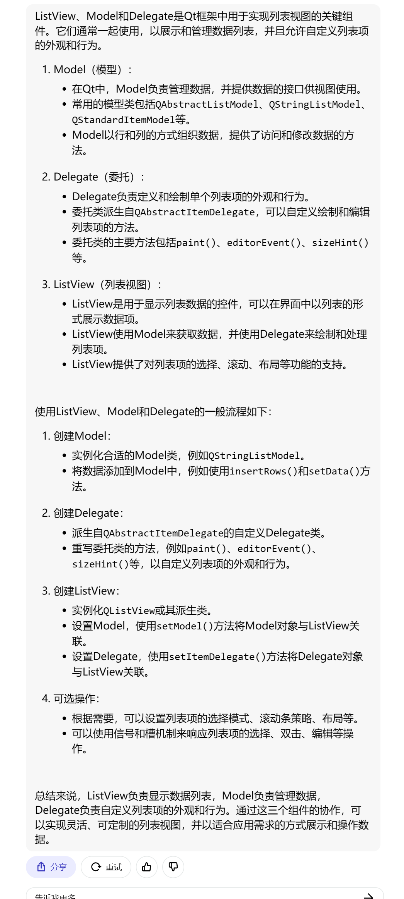

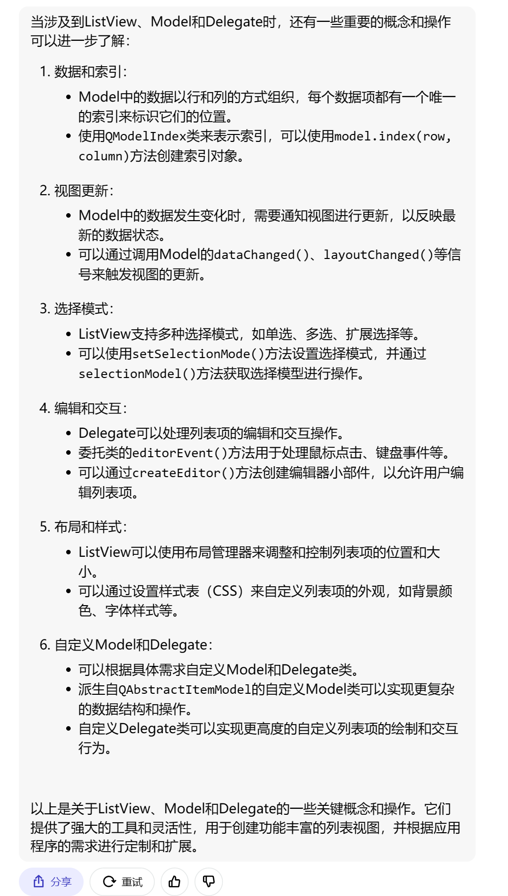

~~~C++
// 创建自定义的Model类
class MyModel : public QAbstractListModel {
    // 实现必要的成员函数，如rowCount()、data()等
};

// 创建自定义的Delegate类
class MyDelegate : public QAbstractItemDelegate {
    // 实现必要的成员函数，如paint()、editorEvent()等
};

// 在主窗口或对话框中使用ListView
QListView *listView = new QListView(this);

// 创建Model对象
MyModel *model = new MyModel(this);

// 设置Model
listView->setModel(model);

// 创建Delegate对象
MyDelegate *delegate = new MyDelegate(this);

// 设置Delegate
listView->setItemDelegate(delegate);

// 添加数据到Model
model->insertRows(0, 3);  // 假设插入3行数据
model->setData(model->index(0, 0), "Item 1");
model->setData(model->index(1, 0), "Item 2");
model->setData(model->index(2, 0), "Item 3");

// 显示ListView
listView->show();
~~~


## 实例

### 根据信息长度，设置不同的大小

~~~C++
//.h
#ifndef MAINWINDOW_H
#define MAINWINDOW_H

#include <QMainWindow>
#include <QListView>
#include <QStandardItemModel>
#include <QStyledItemDelegate>
#include <QPainter>
#include <QStringListModel>

QT_BEGIN_NAMESPACE
namespace Ui { class MainWindow; }
QT_END_NAMESPACE
// 自定义委托类
class CustomDelegate : public QStyledItemDelegate {
public:
    // 设置Rict大小
    QSize sizeHint(const QStyleOptionViewItem &option, const QModelIndex &index) const {
        QString message = index.data(Qt::DisplayRole).toString();
//        QString message = index.data(Qt::DisplayRole).value<QString>();

        int width = 200;
        int height = message.length() * 10;

        return QSize(width, height);
    }
    void paint(QPainter *painter, const QStyleOptionViewItem &option, const QModelIndex &index) const override {
        // 自定义绘制项的外观
        painter->save();

        QColor backgroundColor = QColor(255, 0, 0); // 设置为红色背景，可以根据需要修改颜色
        if (option.state & QStyle::State_Selected) {
            // 绘制选中项的背景
            painter->fillRect(option.rect, option.palette.highlight());
        }

//        painter->fillRect(option.rect, backgroundColor);

        // 绘制文本
        painter->drawText(option.rect, Qt::AlignCenter, index.data().toString());

        painter->restore();
    }
};
class MainWindow : public QMainWindow
{
    Q_OBJECT

public:
    MainWindow(QWidget *parent = nullptr);
    ~MainWindow();
    // 创建模型
    QStandardItemModel model;
    QStringListModel model_sl;
    // 设置委托
    CustomDelegate delegate;
private:
    Ui::MainWindow *ui;

};
#endif // MAINWINDOW_H

~~~

~~~C++
//.cpp
#include "MainWindow.h"
#include "ui_MainWindow.h"
#include <QListView>
#include <QStandardItemModel>
#include <QStyledItemDelegate>
#include <QVBoxLayout>
#include <QWidget>


MainWindow::MainWindow(QWidget *parent)
    : QMainWindow(parent)
    , ui(new Ui::MainWindow)
{
    ui->setupUi(this);
    model.appendRow(new QStandardItem("Short message."));
    model.appendRow(new QStandardItem("This is a longer message that requires more height."));
    model.appendRow(new QStandardItem("Another message."));
    model.appendRow(new QStandardItem("A very long message that needs even more height than before."));

    QStringList sl;
    sl << "asdadasda" << "sada" << "sadogfhnreojqf" << "sadasdgrhytsvbyjurfdv";
    int row = model_sl.rowCount(); // 获取当前行数
    model_sl.insertRows(row, sl.count()); // 插入新行
    for (int i = 0; i < sl.count(); ++i) {
        QModelIndex index = model_sl.index(row + i); // 获取插入行的索引
        model_sl.setData(index, sl[i], Qt::DisplayRole); // 设置数据
    }
    ui->listView->setModel(&model_sl);

    ui->listView->setItemDelegate(&delegate);
}

MainWindow::~MainWindow()
{
    delete ui;
}


~~~

# TigerOther

## 打包

#### 版本号

common文件

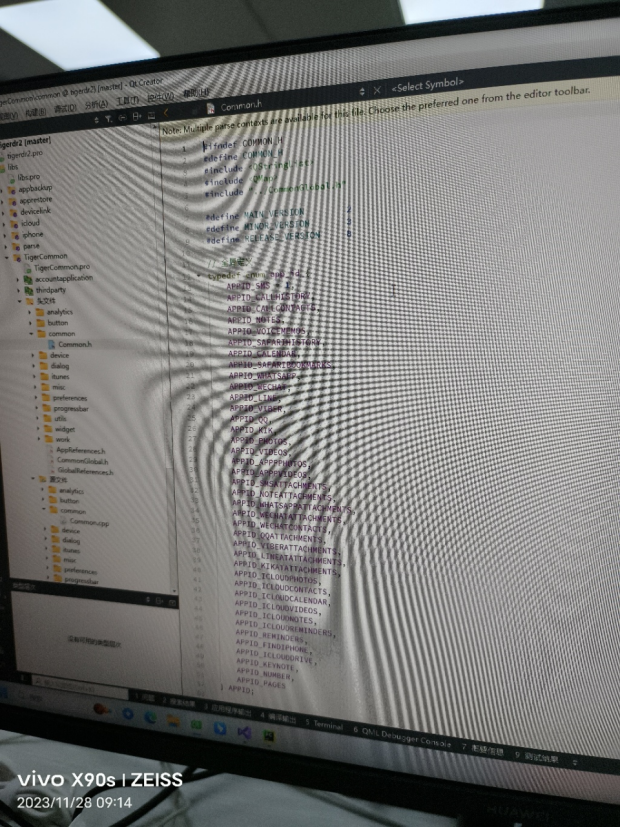

main.py文件


vs2019资源管理器

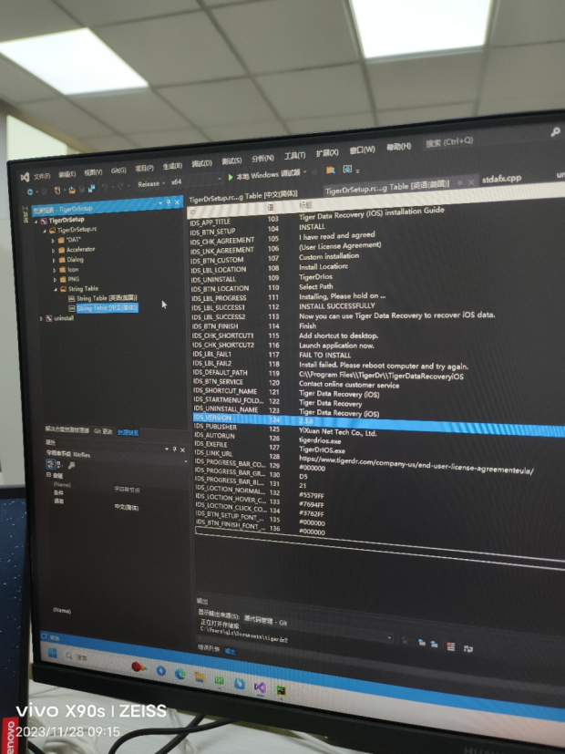

#### 功能检查/测试

检索是否能用

语音是否正常

缩略图是否正常

图片是否能打开

视频是否能播放

其他功能是否正常

导出功能即结果是否符合预期

#### 打包

##### 检查

构建编译release版本

vs2019打开TigerDrSetup中的sln文件

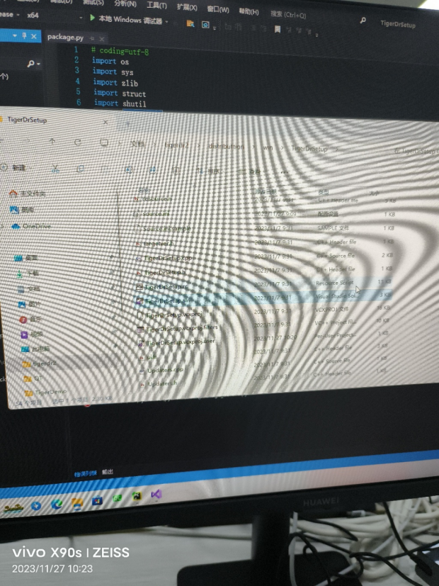

pycharm打开win目录

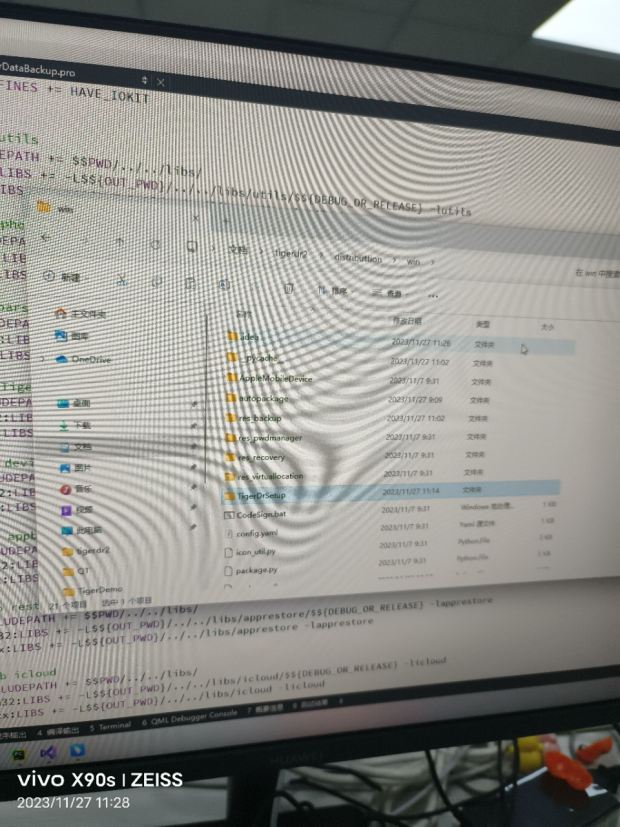

修改sln中的package.py和pycharm中的before/after文件中的路径，其他文件中的相对路径也可能不对


查看sln属性，应为package_bofor/after

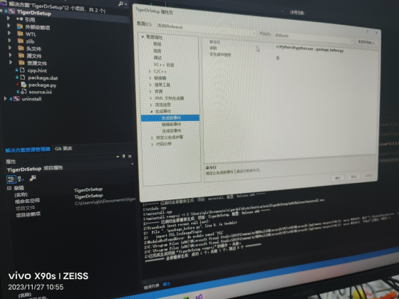

修改befor/after文件中的配置，打什么包配置什么

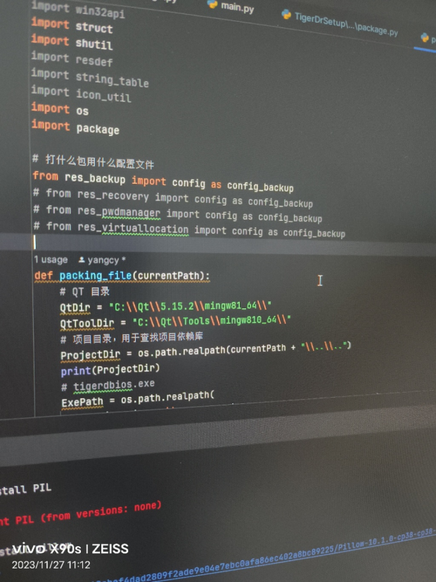

签名密码所在文件main.py

 


##### Vs2019

重新生成解决方案

##### pycharm

根据需要，打不同源的包

 


进行自动化打包:Run main.py

#### Mac

运行package.sh文件，并设置dmg文件名

 

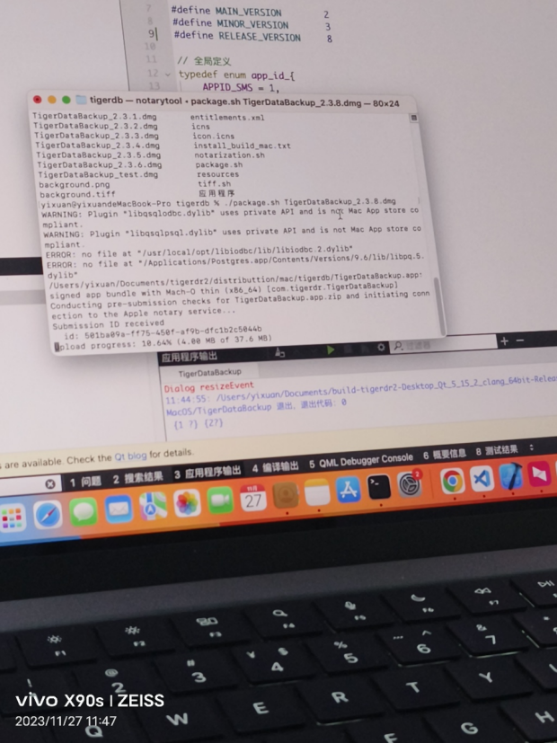

过程中会出现弹窗，选择替换

#### 测试

安装后测试功能，并检查各个版本安装包的数字签名

#### 将包进行分类

 

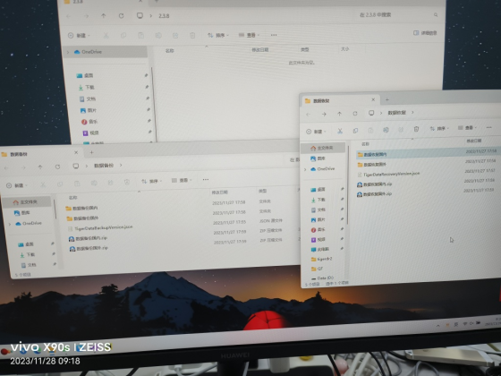

⑖	

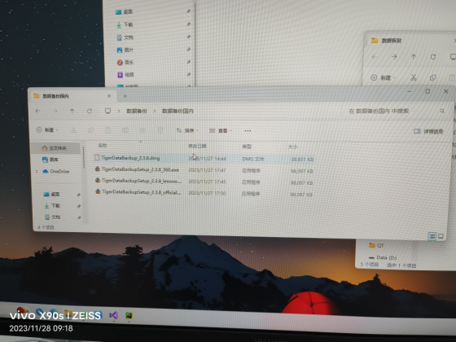

⑖	

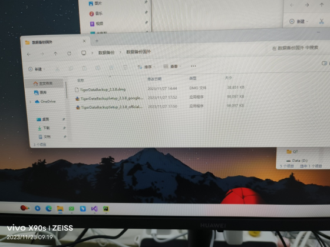

#### 生成md5文件

按版本号创建目录并在代码中指定路径

 

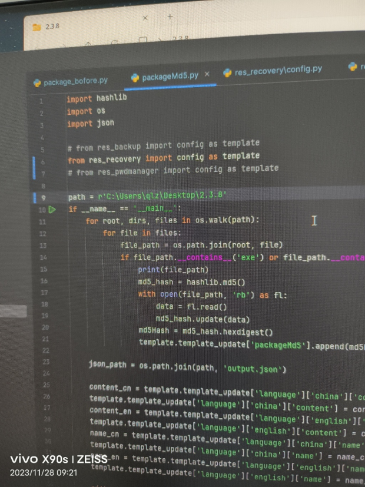

将数据恢复或数据备份的国内国外版本放到指定目录中

点击对应功能的配置跳转到指定位置

 

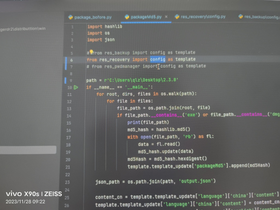

修改发布日期和版本号即可

 

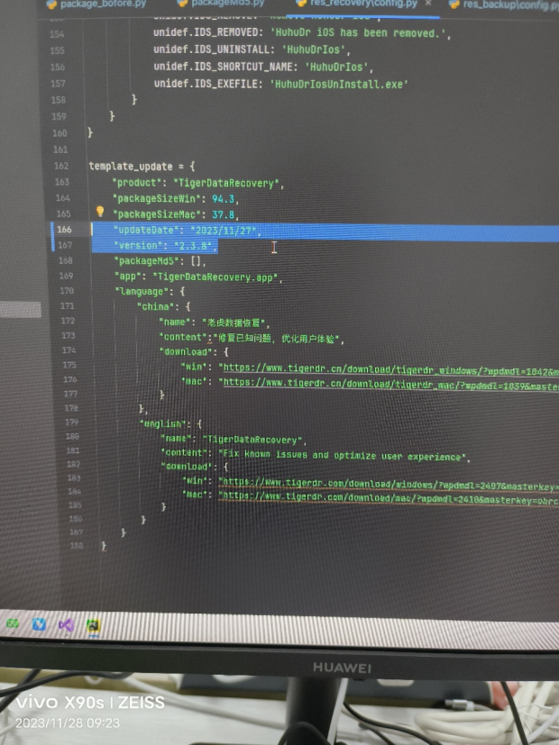

运行生成后将json文件重命名为

> TigerDataBackupVersion.json
>
> TigerDataRecoveryVersion.json

#### 修改release.txt

提交更新信息，并将该文件单独commit

 

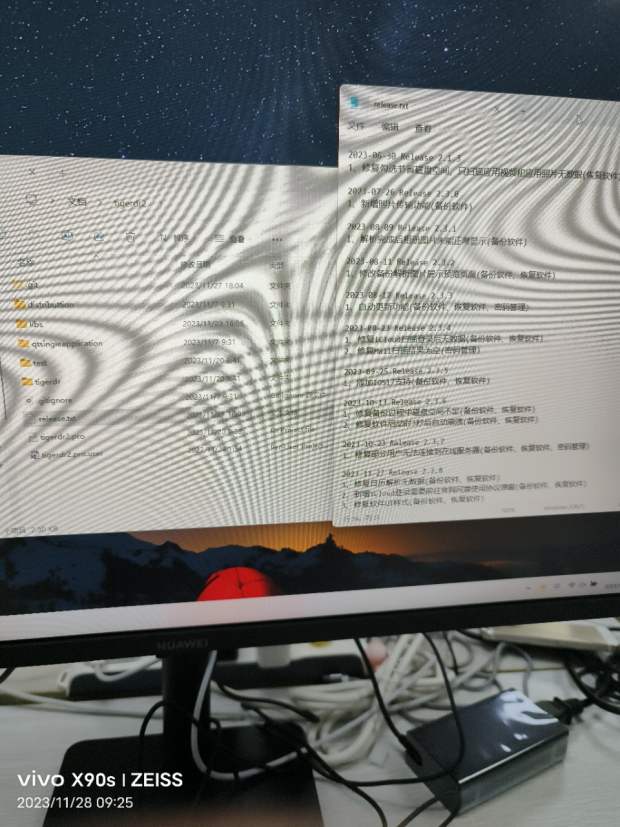

## 自动打包脚本

#### 代码

~~~python
# -*- coding:utf-8 -*-
import threading
import time
import pywinauto
from threading import Timer
import os
import subprocess
import shutil
import pathlib
import re

version = '2.3.8'
currentPath = os.path.dirname(os.path.realpath(__file__))
projectDir=os.path.realpath(currentPath + "\\..\\TigerDrSetup")
msbuild = r'C:\Program Files (x86)\Microsoft Visual Studio\2019\Community\MSBuild\Current\Bin\MSBuild.exe'
# sources = ["official", "360Safe", "Huawei", "Lenovo", "Tencent","toutiao", "google"]
# sources = ["huhu(test)", "huhu(official)", "huhu(google)"]
# sources = ['Lenovo', '360', 'official', 'google']
# sources = ["google", "360"]
sources = ["test"]
outputDir = os.path.expanduser("~/Desktop")

def autoPassword():
    try:
        hwnd = pywinauto.findwindows.find_window(title='Token Logon')
        app = pywinauto.Application().connect(handle=hwnd)
        win = app.top_window();
        # win.print_control_identifiers()
        # win['Edit2'].set_text('ETVhajZo006UPXz0')
        # huhu签名密码
        win['Edit2'].set_text('4gX5RG4zfsdKSrNb')
        win['Button0'].click()
    except Exception as e:
        print(e)
    global timer
    timer = Timer(1,autoPassword)
    timer.start()


timer = Timer(1,autoPassword)

def buildProject(projectDir,sln):
    os.chdir(projectDir)
    cmd = f"{msbuild} {sln} /t:Rebuild /p:Configuration=Release;Platform=x64"
    subprocess.run(cmd)

def creatSourceIni(projectDir,source):
    with open(f"{projectDir}\\Source.ini","w+") as f:
        f.writelines(["[General]\n",f"Source={source}\n"])

def checkVersion(projectDir,version):
    rc = f"{projectDir}\\TigerDrSetup.rc"
    #with open(rc,"r",encoding='utf-16le') as f:
    with open(rc, "r", encoding='gbk') as f:
        rcdata = f.read()
        result = re.findall('IDS_VERSION[^"]*"([^"]*)"',rcdata,re.I | re.M | re.S)
        for match in result:
            if match != version:
                raise Exception("版本错误!")


if __name__ == '__main__':
    # 自定输入密码的定时器
    timer.start()
    # 版本检查
    checkVersion(projectDir,version)
    # 创建输出路径
    p = pathlib.Path(f"{outputDir}\\{version}")
    p.mkdir(parents=True, exist_ok=True)
    # 编译所有来源的项目
    for source in sources:
        creatSourceIni(projectDir,source)
        buildProject(projectDir,"TigerDrSetup.sln")
        # tiger打包路径
        # shutil.copy(f"{projectDir}\\..\\setup.exe",f"{outputDir}\\{version}\\TigerDbSetup_{version}_{source.lower()}.exe")
        shutil.copy(f"{projectDir}\\..\\setup.exe",f"{outputDir}\\{version}\\TigerDbSetup_{version}_{source.lower()}.exe")
        # Huhu打包路径
        # shutil.copy(f"{projectDir}\\..\\setup.exe",f"{outputDir}\\{version}\\HuhuDbSetup_{version}_{source.lower()}.exe")
    timer.cancel()


~~~

> 这段脚本是一个 Python 脚本，它执行一系列操作来编译和打包名为 "TigerDrSetup" 的项目。下面是对脚本的解释：
>
> 1. 导入所需的模块和库：
>    - `threading`：用于创建和管理线程。
>    - `time`：提供时间相关的功能。
>    - `pywinauto`：用于自动化 Windows 桌面应用程序的库。
>    - `os`：提供与操作系统交互的功能。
>    - `subprocess`：用于在脚本中执行外部命令。
>    - `shutil`：用于高级文件操作，如复制和移动文件。
>    - `pathlib`：提供处理文件路径的功能。
>    - `re`：用于正则表达式匹配。
> 2. 定义了一些变量：
>    - `version`：指定项目的版本号。
>    - `currentPath`：获取当前脚本文件的路径。
>    - `projectDir`：设置项目的路径。
>    - `msbuild`：指定 MSBuild.exe 的路径。
>    - `sources`：一个包含来源名称的列表，用于编译不同来源的项目。
>    - `outputDir`：指定输出目录的路径。
> 3. 定义了一个方法 `autoPassword()`：
>    - 该方法用于自动填写密码，通过使用 pywinauto 库找到名为 "Token Logon" 的窗口，然后在窗口中找到密码输入框并填入密码，最后点击确定按钮。
>    - 使用 `timer` 对象每隔1秒调用一次该方法，实现定时自动填写密码的功能。
> 4. 定义了一个方法 `buildProject(projectDir, sln)`：
>    - 该方法用于构建指定的项目。
>    - 通过切换当前工作目录到项目目录，使用 `subprocess.run()` 执行命令行命令来调用 MSBuild.exe 进行项目的重新构建。
> 5. 定义了一个方法 `creatSourceIni(projectDir, source)`：
>    - 该方法用于创建一个名为 "Source.ini" 的文件，并将给定的来源名称写入文件中。
> 6. 定义了一个方法 `checkVersion(projectDir, version)`：
>    - 该方法用于检查项目的版本号是否与指定的版本号匹配。
>    - 通过读取项目中的 "TigerDrSetup.rc" 文件，使用正则表达式匹配版本号，并与指定的版本号进行比较。如果不匹配，则抛出异常。
> 7. 在主程序入口 `if __name__ == '__main__':` 中执行以下操作：
>    - 启动自动填写密码的定时器。
>    - 进行版本检查，确保项目的版本号与指定的版本号匹配。
>    - 创建输出目录。
>    - 针对每个来源名称，在项目中生成对应的 "Source.ini" 文件，然后调用 `buildProject()` 方法构建项目。
>    - 使用 `shutil.copy()` 复制生成的安装程序（setup.exe）到输出目录，并根据来源名称和版本号进行命名。
>    - 取消定时器，结束自动填写密码的功能。
>
> 这个脚本的主要目的是编译和打包 "TigerDrSetup" 项目的不同来源版本，并将生成的安装程序复制到指定的输出目录中。还包括自动填写密码的功能，用于自动化密码输入操作。

#### 详情

###### autoPassword()

> `autoPassword()` 方法是一个定时器回调函数，用于自动填写密码。下面对该函数进行详细解释：
>
> 1. 使用 `pywinauto.findwindows.find_window(title='Token Logon')` 找到标题为 "Token Logon" 的窗口，并返回窗口的句柄（handle）。
> 2. 使用 `pywinauto.Application().connect(handle=hwnd)` 连接到指定句柄的应用程序，并返回应用程序的对象。
> 3. 获取顶层窗口对象：`win = app.top_window()`。
> 4. 通过 `win['Edit2']` 获取密码输入框的控件对象。
> 5. 使用 `set_text('4gX5RG4zfsdKSrNb')` 方法将密码文本设置为 `'4gX5RG4zfsdKSrNb'`（密码字符串）。
> 6. 使用 `win['Button0'].click()` 点击确认按钮，提交密码。
> 7. 如果在执行上述步骤的过程中发生异常，将异常信息打印出来。
> 8. 创建一个全局的 `timer` 对象，每隔1秒钟调用一次 `autoPassword()` 方法，实现自动填写密码的定时功能。
>
> 总结：`autoPassword()` 方法利用 `pywinauto` 库自动化地找到密码输入框，并填入指定的密码文本，然后点击确认按钮。通过定时器的调用，可以实现定时自动填写密码的功能。在主程序中启动定时器后，该方法会被周期性地调用，以确保密码自动填写的持续性。

######  buildProject(projectDir, sln)

> `buildProject(projectDir, sln)` 方法用于构建指定的项目。下面对该方法进行详细解释：
>
> 1. 切换当前工作目录到项目目录：`os.chdir(projectDir)`。这样做是为了确保在正确的路径下执行构建命令。
> 2. 构建命令的格式为：`{msbuild} {sln} /t:Rebuild /p:Configuration=Release;Platform=x64`。其中，`msbuild` 是指定的 MSBuild.exe 的路径，`sln` 是要构建的解决方案文件的路径。
> 3. 使用 `subprocess.run(cmd)` 执行构建命令。`subprocess.run()` 方法可以运行外部命令，并等待命令执行完成。
> 4. 构建命令中的参数解释：
>    - `/t:Rebuild`：指定重新构建项目，而不是增量构建。
>    - `/p:Configuration=Release`：指定构建配置为 Release，即发布版本。
>    - `/p:Platform=x64`：指定目标平台为 64 位。
>
> 总结：`buildProject(projectDir, sln)` 方法通过调用 MSBuild.exe 执行构建命令，重新构建指定的项目。通过切换工作目录和传递命令行参数，可以确保项目在正确的配置和平台下进行构建。

######  creatSourceIni(projectDir,source)

> 函数`creatSourceIni(projectDir, source)`用于创建一个名为"Source.ini"的文件，并将指定的来源信息写入该文件。下面是对该函数的详细说明：
>
> 函数签名：
>
> ```
> def creatSourceIni(projectDir, source):
> ```
>
> 参数：
>
> - `projectDir`：表示项目目录的字符串，指定了项目目录的路径。
> - `source`：表示来源的字符串，指定了要写入"Source.ini"文件的来源信息。
>
> 函数功能：
>
> - 在指定的项目目录下创建一个名为"Source.ini"的文件，并写入来源信息。
>
> 函数实现：
>
> 1. 打开"Source.ini"文件以进行写入操作。使用`open()`函数，并指定文件模式为"w+"，表示可读写打开文件，如果文件不存在则创建。
> 2. 使用文件对象的`writelines()`法，将要写入的内容以列表的形式写入文件。
>    - `[General]`：写入"[General]"作为文件的第一行，表示一个节的开始。
>    - `Source=`：写入"Source="作为节的内容，表示来源的键。
>    - `source`：写入`source`作为来源的值。
> 3. 关闭文件。
>
> 示例调用：
>
> ```
> creatSourceIni(projectDir, "test")
> ```
>
> 示例输出：
> 在指定的项目目录下创建了一个名为"Source.ini"的文件，并写入以下内容：
>
> ```
> [General]
> Source=test
> ```
>
> 该函数的作用是为指定的项目创建一个用于存储来源信息的配置文件，以便后续在构建项目时使用正确的来源。

###### checkVersion(projectDir,version)

> 函数`checkVersion(projectDir, version)`用于检查指定项目的版本是否与预期版本一致。下面是对该函数的详细说明：
>
> 函数签名：
> ```python
> def checkVersion(projectDir, version):
> ```
>
> 参数：
> - `projectDir`：表示项目目录的字符串，指定了项目目录的路径。
> - `version`：表示预期版本的字符串，指定了要检查的版本号。
>
> 函数功能：
> - 检查指定项目的版本号是否与预期版本号一致。
>
> 函数实现：
> 1. 构建一个文件路径，表示项目中的版本信息文件。使用`os.path.join()`函数，将项目目录和版本信息文件名拼接起来。
> 2. 打开版本信息文件以进行读取操作。使用`open()`函数，并指定文件模式为"r"，表示只读打开文件。
> 3. 读取版本信息文件的内容。使用文件对象的`read()`方法，将文件的内容读取为一个字符串。
> 4. 使用正则表达式进行版本号的匹配。使用`re.findall()`函数，传入正则表达式模式、待匹配的字符串和匹配标志，以提取版本号。
>    - 正则表达式模式：`'IDS_VERSION[^"]*"([^"]*)"'`，匹配以"IDS_VERSION"开头，后跟任意字符（非引号），然后以引号结束的模式。
>    - 待匹配的字符串：版本信息文件的内容。
>    - 匹配标志：使用`re.I`表示不区分大小写，`re.M`表示多行匹配，`re.S`表示单行模式（"."匹配包括换行符在内的所有字符）。
> 5. 遍历匹配结果，检查是否存在与预期版本号一致的版本号。如果存在不一致的版本号，则抛出异常。
> 6. 关闭文件。
>
> 示例调用：
> ```python
> checkVersion(projectDir, '2.3.8')
> ```
>
> 该函数的作用是读取项目中的版本信息文件，并提取其中的版本号，然后与预期版本号进行比较，以确保项目的版本号与预期一致。如果版本号不一致，函数将抛出异常，提示版本错误。这有助于确保项目的版本控制和一致性。

# TigerCode

## BUGorFEATURE

###### 昵称有时候显示有时候不显示

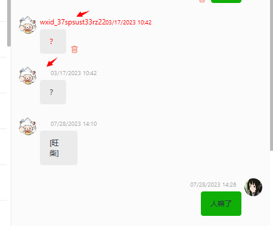

> 原因：item.name为空。本质是删除的消息对应的item设置了form，而未删除的没有设置，需要从构建item的地方入手。
>
> 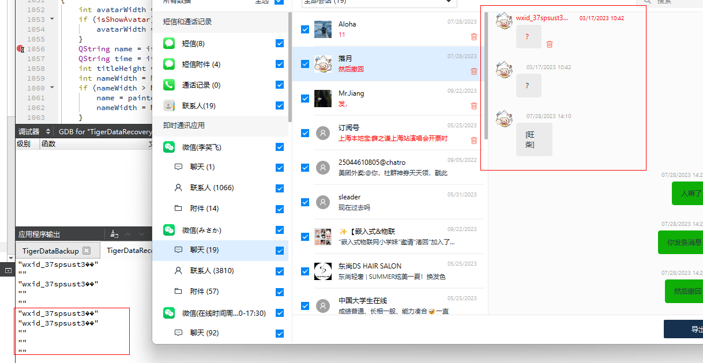

###### 昵称有时候完全显示有时候缩略显示


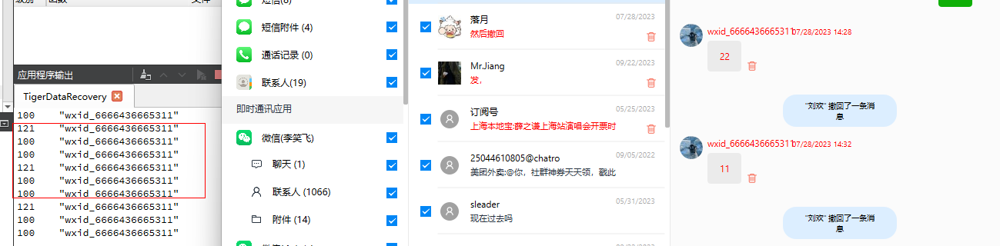


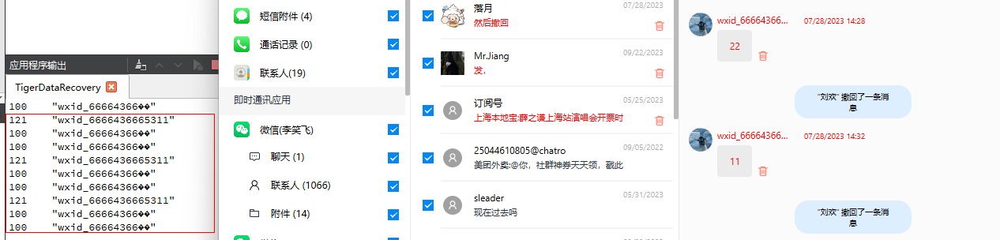

当将鼠标拉至app外，昵称就会完全显示

> 原因：MeasureTextWidth和fonttMetries的字体样式不同，使得获取到的字符串宽度不同。将painter的字体样式设置为font即可
>
> 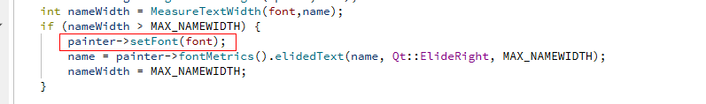
>

