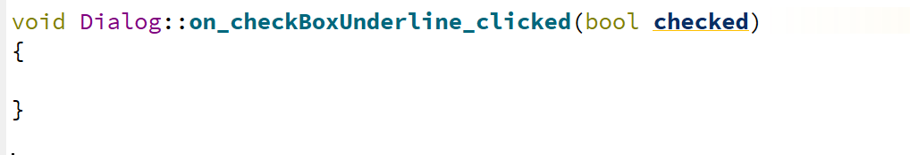
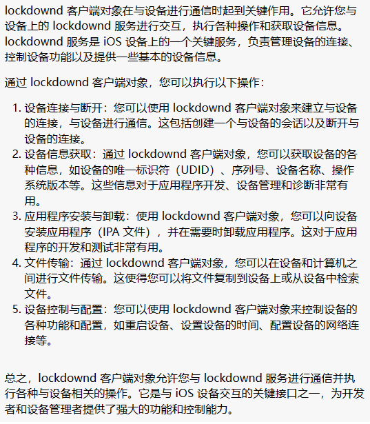

**信号与槽**

**内存管理方式**

# 基础

## 控件

> 1. label：标签，可以显示文本信息，只读；
> 2. pushbutton ： 普通按钮；
> 3. radiobutton ： 单选按钮，多个单选按钮中只能选择一个，但是必须放入groupbox中，类似单选题；
> 4. checkbox ： 多选复选按钮，可以选择同时选择多个，类似多选题；
> 5. lineedit ： 单行文本编辑框，可以输入单行文本；
> 6. textedit ： 多行文本输入框，可以输入显示多行文本和图片；
> 7. combobox ： 下拉文本输入框，在输入框的最右边有个三角下拉按钮，可以选择输入，也可以手动输入；
> 8. textbrower ： 多行文本显示框，只读；
> 9. groupbox ： 可以在里面放入特点的东西，统一管理；
> 10. slider ： 模拟显示滑动条；
> 11. spinbox ： 数值显示滑动条；
> 12. dateedit ：
> 13. timeedit ：
> 14. datetimeedit ：
> 15. lcdnumber ：

## 基础类

### QAbstractButton

> QAbstractButton 类是按钮小部件的抽象基类，提供按钮通用的功能。

1. 设置文本

2. 设置主题(图像)及大小

3. 设置快捷键

4. 设置默认选择按钮

5. 四种选择

6. 四种信号

7. - 是否独占
    - 是否重复，及重复间隔
    - 是否可以被选中
    - 是否被选中
    - 是否按下
    - 助记符，文本

### QWidget Class

> QWidget 类是所有用户界面对象的基类。

1. 函数
2. 设置子部件的描述和名称
3. 是否填充小部件背景
4. 设置小部件的基本尺寸，位置，max/min
5. 设置字体
6. 是否最大化，最小化，滑动窗口
7. ...

### QLabel

> QLabel 用于显示文本或图像。不提供用户交互功能。标签的视觉外观可以通过多种方式进行配置，并且可以用于为另一个小部件指定焦点助记键。
>
> 

1. 是否有内容被选中
2. 保存选定的文本
3. 设置文本缩进
4. 边距
5. 是否自动打开文本里的链接
6. 设置图片
7. 是否缩放图片，使得像素图填充可用空间
8. 设置文本
9. 设置文本格式
10. 是否自动换行

## 样式表

> 选择器+声明，可以指定一个类型，对象，控件的样式风格。
>
> 1. Qt 官方文档：Qt 官方文档提供了有关 Qt 样式表的详细说明和示例。您可以查阅官方文档以获取更多信息。
>    - Qt 样式表文档（英文）：https://doc.qt.io/qt-5/stylesheet.html
> 2. Qt Style Sheets Examples：Qt 官方提供了一些 Qt 样式表的示例，展示了不同控件的样式设置和效果。您可以通过这些示例来学习和尝试 Qt 样式表的用法。
>    - Qt 样式表示例（英文）：https://doc.qt.io/qt-5/stylesheet-examples.html
> 3. Qt Style Sheets Reference：这个页面列出了 Qt 样式表中可用的所有属性和伪状态，以及它们的描述和使用方式。您可以在这里找到您需要的属性和伪状态的信息。
>    - Qt 样式表参考（英文）：https://doc.qt.io/qt-5/stylesheet-reference.html
> 4. Qt Style Sheets Examples on GitHub：Qt 在 GitHub 上提供了一些 Qt 样式表的示例代码，您可以查看源代码并尝试运行这些示例。
>    - Qt 样式表示例代码（英文）：https://github.com/qt/qtstyleplugins/tree/dev/examples/stylesheet

### 选择器类型

> 
>

1. 按类选，且包含它的子类
2. 按类选，且不包含它的子类
3. 按对象ID选
4. 按属性要求选

### 子控件

### 伪状态

> 
>
> **一些伪装态可以设置在样式表，一些则只能通过函数设置。和样式表一样，通过函数设置时，也可以选择对象调用函数设置，或者是类内调用函数设置**

1. 鼠标悬停/未悬停

## 布局

### 水平布局/垂直布局

### 弹簧

### DPI变化

## 信号和槽

> 

[Qt一篇全面的信号和槽函数机制总结 - 知乎 (zhihu.com)](https://zhuanlan.zhihu.com/p/603617075)

[Qt 信号和槽的机制（逻辑清晰的来说清楚信号和槽，呕心沥血之作）_qt的信号与槽机制原理-CSDN博客](https://blog.csdn.net/ifeng12358/article/details/120880153)

# 认识QT

## UI文件设计与运行机制

.pro 项目管理文件

.ui 界面文件

主函数

图形相关文件

.h文件

.cpp

ui\_\*\*_.h

## 可视化UI

### 界面UI

### 三种信号触发方式

###### 第一种

1. 在UI界面选中目标，并右键点击，选择对应函数

2. 编写对应逻辑

   

###### 第二种

> 将ui_dialog.h的内容提到cpp文件里

编译生成的ui_dialog.h文件中，有对应的调用函数及逻辑，可将其拷贝修改至CPP文件

可以认为是第一种的手动版，但CPP的文件不会随着ui的改动而变化。

## 代码化UI

没有UI文件，需要自己设计界面，较抽象。

## 混合UI

# 实例

### 场景1

#### 实现

#### 构思

> 

#### 效果

> 默认
>
> 

> 拉伸
>
> 
>
> 

> 账号按钮
>
> 

> 隐藏按钮
>
> 

> 伪类选择器
>
> 

# Bug

#### 在构造函数里设置样式不生效

解决办法

#### 自写类样式不生效

#### 字体类型

> 字体类型跟系统走，若系统没有样式所指定的字体类型，则就会无法匹配到合适的字体。
>
> 且字体类型的匹配按顺序匹配，从左至右，知道某个字符匹配到字符

#### DPI

> 开发中，DPI默认为100%模式，但有时候窗口可能会变成高DPI模式，这时候，窗口的尺寸就会失真，达不到我们想要的效果。
>
> 为了解决这个问题，QT支持窗口随DPI变化而改变的需求，使用如下：
>
> 
>
> 第一行用来开启高DPI支持
>
> 第二行用来开启非整数倍缩放因子
>
> 第三行用来设置缩放因子的四舍五入规则

#### 图像

> 图像不能无限扩大，否则会出现锯齿，失真等问题，所以在开发中，一般最高支持2倍扩大，为了保证图像的正常显示，属性一般这样设置：
>
> 
>
> 
>
> 最大最小保证图片不能无限被所需扩大，而填充属性，则用来保证图片的正常比例。

# [libimobiledevice](https://github.com/libimobiledevice/libimobiledevice)

> 
>
> 

## API

### idevice_new_with_options：将对象绑定到udid指定的设备

>
>该函数可以根据udid将对应的设备绑定到device对象上，并通过第三个参数，指定了该设备的连接方式。
>~~~C++
>int idevice_new_with_options(idevice_t* device, const char* udid, uint16_t options);
>idevice_new_with_options(&device, udid, IDEVICE_LOOKUP_USBMUX | IDEVICE_LOOKUP_NETWORK);
>
>//释放
>idevice_free(device);
>~~~
>
>

> 
>
> 

### lockdownd_client_new：将lockdownd 客户端对象绑定到指定的设备对象

> 该函数可以通过device对象创建一个lockdownd服务客户端对象，但需要自己处理之后的通信协议细节
>
> ~~~C++
> int lockdownd_client_new(idevice_t device, lockdownd_client_t* client, const char* label);
> lockdownd_client_new(device, &client, TOOL_NAME);
> 
> //释放
> lockdownd_client_free(client)
> ~~~
>
> 

> 
>
> 

**lockdownd对象**

> 

**返回值对应的宏**

> 

### lockdownd_get_device_name：获取设备名字

> 该函数可以通过lockdo客户端对象获取其绑定的设备的名字。
> ~~~C++
> int lockdownd_get_device_name(lockdownd_client_t client, char** device_name);
> lockdownd_get_device_name(client, &device_name)
> ~~~
>
> 

> 

### lockdownd_pair：进行配对操作

> 该函数可以将lockdownd客户端对象与其绑定的设备进行配对，以建立一个互相信任的通信。
>
> ~~~C++
> lockdownd_pair(client, NULL);
> idevice_error_t lockdownd_pair(lockdownd_client_t client, plist_t *pair_record);
> ~~~
>
> 

> 

### userpref_get_paired_udids：获取已配对设备列表

> 能够获取已配对设备的UDID列表
>
> ~~~C++
> userpref_get_paired_udids(&udids, &count);
> idevice_error_t userpref_get_paired_udids(const char *udid_list[], int *count);
> ~~~
>
> 

> 

### idevice_get_udid：获取链接的设备的UDID，默认只连接了一部

> 通过idevice对象，获取其所连接的设备的UDID
>
> ~~~C++
> idevice_get_udid(device, &udid);
> idevice_error_t idevice_get_udid(idevice_t device, char **udid);
> ~~~
>
> 

> 

### userpref_read_pair_record：获取udid对应设备的历史配对记录

> 能够通过udid，获取到其对应的设备历史配对记录，并将其保存在一个列表里。
>
> ~~~C++
> userpref_read_pair_record(udid, &pair_record);
> userpref_error_t userpref_read_pair_record(const char *udid, plist_t *pair_record)
> ~~~
>
> 

> 

### pair_record_get_host_id：提取记录中主机ID

> 通过记录列表中的信息，提取到主机ID，并将其保存在一个字符串数组里。
>
> ~~~C++
> pair_record_get_host_id(pair_record, &hostid);
> userpref_error_t pair_record_get_host_id(plist_t pair_record, char** host_id)
> ~~~
>
> 

> 

### lockdownd_query_type：查询设备类型

> 用于查询设备的特定信息或属性
>
> ~~~C++
> lockdownd_query_type(client, &type);
> LIBIMOBILEDEVICE_API lockdownd_error_t lockdownd_query_type(lockdownd_client_t client, char **type)
> ~~~

> 

### lockdownd_client_new_with_handshake：用于与 iOS 设备上的 "lockdownd" 守护进程建立连接并进行握手

> 相较于lockdownd_client_new，做了更多的事：建立lockdownd服务客户端对象后，会自己处理通信协议
>
> ~~~C++
> lockdownd_client_new_with_handshake(device, &client, TOOL_NAME);
> LIBIMOBILEDEVICE_API lockdownd_error_t lockdownd_client_new_with_handshake(idevice_t device, lockdownd_client_t *client, const char *label)；
> ~~~
>
> 

> 
>
> 

### lockdownd_unpair：解除lockdownd_client对象与设备的配对

> 用于解除设备与主机的配对关系。
>
> ~~~C++
> lockdownd_unpair(client, NULL);
> lockdownd_error_t lockdownd_pair(lockdownd_client_t client, lockdownd_pair_record_t pair_record)
> ~~~
>
> 

### lockdownd_start_service：

> 用于启动指定的服务。
>
> ~~~C++
> lockdownd_start_service(lockdown, AFC_SERVICE_NAME, &service);
> lockdownd_error_t lockdownd_start_service(lockdownd_client_t client, const char *identifier, lockdownd_service_descriptor_t *service)
> ~~~
>
> 

> 
>
> 

### afc_client_new：用于创建一个 AFC（Apple File Conduit）客户端对象。

> 通过device，service创建一个afc对象。
>
> ~~~C++
> afc_client_new(device, service, &afc);
> afc_error_t afc_client_new(idevice_t device, lockdownd_service_descriptor_t service, afc_client_t * client)
> ~~~
>
> 

> 

### lockdownd_start_service_with_escrow_bag：用于启动带有保管袋（escrow bag）的服务。

> 用于启动带有保管袋（escrow bag）的服务。保管袋是一种加密的文件，用于存储设备密钥和其他安全相关的信息。通过lockdownd客户端对象和指定的服务，并将其保存在第三个参数里。
>
> ~~~C++
> lockdownd_start_service_with_escrow_bag(lockdown, MOBILEBACKUP2_SERVICE_NAME, &service);
> lockdownd_error_t lockdownd_start_service_with_escrow_bag(lockdownd_client_t client, const char *identifier, lockdownd_service_descriptor_t *service)
> ~~~
>
> 

> 

### mobilebackup2_client_new：用于创建一个 MobileBackup2 客户端对象

> 通过deiveice对象，服务，创建一个客户端对象，并将其保存在第三个参数里。
>
> ~~~C++
> mobilebackup2_client_new(device, service, &mobilebackup2);
> mobilebackup2_error_t mobilebackup2_client_new(idevice_t device, lockdownd_service_descriptor_t service,
> 						mobilebackup2_client_t * client)
> ~~~
>
> 

> 

### mobilebackup2_version_exchange：交换版本号

> 通过mobilebackup2客户都对象，与服务的交换版本号
>
> ~~~C++
> mobilebackup2_version_exchange(mobilebackup2, local_versions, 2, &remote_version);
> mobilebackup2_error_t mobilebackup2_version_exchange(mobilebackup2_client_t client, double local_versions[], char count, double *remote_version)
> ~~~
>
> 

> 

### do_post_notification：用于在给定的设备上发送通知。

> 给给定的设备发送通知
>
> ~~~C++
> do_post_notification(device, NP_SYNC_WILL_START);
> static void do_post_notification(idevice_t device, const char *notification)
> ~~~
>
> 

> 

### afc_file_open：用于在 AFC（Apple File Conduit）连接上打开文件的函数。它的作用是在给定的 AFC 连接上打开指定路径的文件，并将文件句柄存储在 `lockfile` 变量中。

> 
>
> ~~~C++
> afc_file_open(afc, "/com.apple.itunes.lock_sync", AFC_FOPEN_RW, &lockfile);
> afc_error_t afc_file_open(afc_client_t client, const char *filename, afc_file_mode_t file_mode, uint64_t *handle)
> ~~~
>
> 

> 

## 功能

### 查询设备名字

##### 获取idevice对象

~~~C++
idevice_new_with_options(&device, udid, IDEVICE_LOOKUP_USBMUX | IDEVICE_LOOKUP_NETWORK);
~~~

- 如果指定了udid，则会获取到udid对应的设备；

- 如果没有指定，则udid对应实参传NULL，随机获取一个连接的设备

通过device对象，可以获取到设备的udid

##### 获取lockdownd服务客户端对象

~~~C++
lockdownd_client_new(device, &client, TOOL_NAME)
~~~

- 通过device对象，可以建立获得一个lockdownd客户端对象，用来锁定设备
- 第三个参数用来指定lockdownd服务名称

##### 获取设备名称

~~~C++
lockdownd_get_device_name(client, &device_name)
~~~

- 通过client对象，能够获得设备的名称

### 设置设备名字

##### 获取设备对象

##### 获取完整的lockdownd服务客户端对象

此处的完整是指，不仅需要获得lockdownd服务客户端对象，这个对象还需要完成后续的协议和身份验证之类的过程。相较于with_options，with_handshake更加完整，但耦合性也高。

~~~C++
lockdownd_client_new_with_handshake(device, &lockdown, TOOL_NAME);
~~~

##### 向手机发送请求

~~~C++
lockdownd_set_value(lockdown, NULL, "DeviceName", plist_new_string(argv[0]));

LIBIMOBILEDEVICE_API lockdownd_error_t lockdownd_set_value(lockdownd_client_t client, const char *domain, const char *key, plist_t value)
{
	if (!client || !value) // 判断服务和名字是否存在
		return LOCKDOWN_E_INVALID_ARG;

	plist_t dict = NULL;
	lockdownd_error_t ret = LOCKDOWN_E_UNKNOWN_ERROR;

    // 构建请求
	/* setup request plist */
	dict = plist_new_dict();
	plist_dict_add_label(dict, client->label);
	if (domain) {
		plist_dict_set_item(dict,"Domain", plist_new_string(domain));
	}
	if (key) {
		plist_dict_set_item(dict,"Key", plist_new_string(key));
	}
	plist_dict_set_item(dict,"Request", plist_new_string("SetValue"));
	plist_dict_set_item(dict,"Value", value);
	
    // 发送请求
	/* send to device */
	ret = lockdownd_send(client, dict);

	plist_free(dict);
	dict = NULL;

	if (ret != LOCKDOWN_E_SUCCESS)
		return ret;
	
    // 接受回复
	/* Now get device's answer */
	ret = lockdownd_receive(client, &dict);
	if (ret != LOCKDOWN_E_SUCCESS)
		return ret;

	ret = lockdown_check_result(dict, "SetValue");
	if (ret == LOCKDOWN_E_SUCCESS) {
		debug_info("success");
	}

	if (ret != LOCKDOWN_E_SUCCESS) {
		plist_free(dict);
		return ret;
	}

	plist_free(dict);
	return ret;
}
~~~

- 构建SetValue请求字典
- 发送请求字典到设备
- 设备处理请求,返回响应字典
- 接收响应字典
- 从响应字典校验设置操作是否成功

### 查询设备ID

##### 获取当前主机所连接的设备的记录列表

~~~C++
idevice_get_device_list_extended(&dev_list, &i)
~~~

- 可以直接获取当前设备保存的连接设备的链表
- 当返回值为负数时，代表获取失败
- 当没有设备连接时，也是可以返回成功的
- 其中，i值代表连接设备的个数
- dev_list存储了连接设备的大量信息

##### 读取配置文件？

~~~C++
userpref_get_paired_udids(char ***list, unsigned int *count)
~~~

### 配对/解除配对

##### 创建device对象

~~~C++
idevice_new_with_options(&device, udid, (use_network) ? IDEVICE_LOOKUP_NETWORK : IDEVICE_LOOKUP_USBMUX);
idevice_get_udid(device, &udid);
~~~

- 创建对象
- -获取udid

##### 创建lockdownd客户端对象

~~~C++
lockdownd_client_new(device, &client, TOOL_NAME);
~~~

- 仅创建lockdownd客户端对象

##### 处理握手过程

包括：

- 查询类型（query_type）
- 验证配对（validate_pair）
- 配对（pair）
- 启动会话（start_session）
- 等

##### 查询类型

~~~C++
lockdownd_query_type(client, &type);
~~~

##### 配对

~~~C++
lockdownd_pair(client, NULL);
~~~

##### 解除配对

~~~C++
lockdownd_unpair(client, NULL);
~~~

### 验证配对

##### 创建device对象

##### 创建自动处理握手的lockdownd对象

~~~C++
lockdownd_client_new_with_handshake(device, &client, TOOL_NAME);
~~~

- 如果调用成功，则代表能够配对
- 否则，代表验证失败

##### 解除配对

### 备份

##### 验证备份目录是否存在

##### 创建idevice对象

##### 创建自动握手的lockdownd客户端对象

##### 开启NP服务：通知服务，非必要

- 开启服务
- 创建np客户端对象

##### 开启AFC服务：文件传输服务

- 开启服务
- 创建对象

##### 开启备份服务——1

- 开启服务
- 创建对象
- 交换版本
- 判断备份方式：全量/增量

##### 处理afc文件——2

- 同步通知
- 处理文件句柄
- 请求同步锁
- 进行文件独占
- 同步开始通知

##### 发送备份请求——3

##### 开始文件传输

> 手机端打包好之后，将数据发送给PC端

- 下载文件
- 上传文件
- 获取可用空间
- 清理空间
- 获取目录内容
- 创建目录
- 移动文件
- 删除文件
- 复制项目
- 断开连接
- 处理消息

## BUG

plist_new_string是什么

~~~C++
CONFIG(debug, debug|release) {
    DEBUG_OR_RELEASE = debug
}  else {
    DEBUG_OR_RELEASE = release
}

# 加载库
# thirdparty libraries
include($$PWD/../thirdparty/thirdparty.pri)

SOURCES += \
    main.c \
    mainbackup.cpp

# Default rules for deployment.
qnx: target.path = /tmp/$${TARGET}/bin
else: unix:!android: target.path = /opt/$${TARGET}/bin
!isEmpty(target.path): INSTALLS += target
~~~

为什么删除拷贝完成后的空目录没有权限

为什么第二次进行备份的时候，直接失败：CTF加载程序问题
